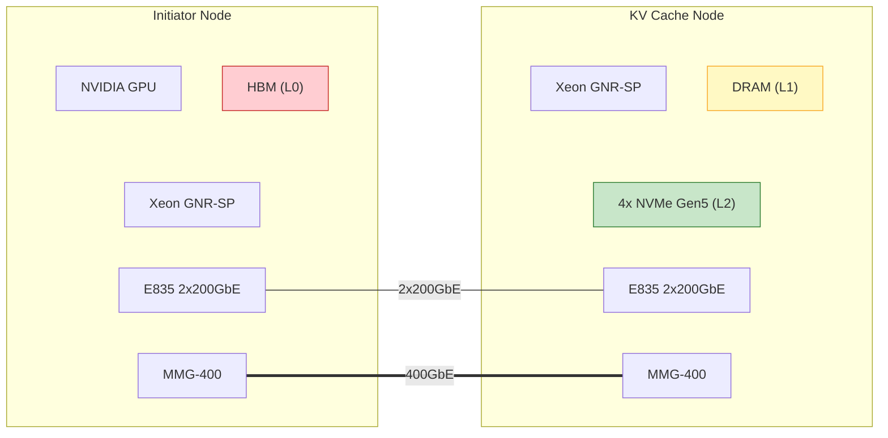

# Executive Summary

This document defines the benchmark configurations, metrics, monitoring, and
analysis methods for validating an IPU-based KV cache data plane. The system
disaggregates KV cache storage from GPU inference hosts, using Intel IPU (Falcon
offload) as the DMA engine on the storage server.

**Key architectural decisions validated by these benchmarks:**

1. **Pull model for writes** -- the target (storage server) controls when and where
   data arrives, preventing buffer exhaustion at 400Gb/s
2. **Zero-copy read path** -- IPU streams pages from registered DRAM to wire via
   DMA gather, CPU never touches data bytes
3. **LMCache as memory management plane** -- buffer allocation, eviction, and
   admission control are a single decision loop
4. **Per-layer KV page transfers** -- 256KB transaction size (FP8, 128 tokens/chunk)
   matches IPU DMA-optimal window

**Benchmark approach:** Use existing LMCache standalone benchmarks
(transfer_channel_benchmark, storage_backend_io, controller_benchmark) with
IPU-representative configurations. No new benchmark code required -- only
configurations and interpretation guidance.


# System Architecture

## Component Overview

**Two-node topology connected by 400G network:**

| | Initiator Node | KV Cache Node |
|--|----------------|---------------|
| **CPU** | Xeon GNR-SP | Xeon GNR-SP |
| **Accelerator** | NVIDIA GPU | -- |
| **Memory** | GPU HBM (L0) + Host DRAM | Registered DRAM (L1) |
| **Storage** | -- | 4x NVMe Gen5 (L2) |
| **NIC** | E835 (2x200GbE) | E835 (2x200GbE) |
| **IPU** | MMG-400 (400GbE) | MMG-400 (400GbE) |

**Symmetric IPU deployment:** Both nodes have an MMG-400 as their primary
data-plane interface. The IPU IS the network for KV cache traffic — there is
no separate NIC in the data path. The E835 provides a 2x200GbE management and
fallback path.

**LMCache tier hierarchy:**

| Tier | Location | Medium | Capacity | Access Latency |
|------|----------|--------|----------|----------------|
| L0 | Initiator Node | GPU HBM | Model-dependent | ~ns (local) |
| L1 | KV Cache Node | Registered DRAM | 64+ GiB | ~5 µs (RDMA hit) |
| L2 | KV Cache Node | 4x NVMe Gen5 | TBs | ~80 µs (SSD fetch) |

**Data path:** L0 miss on the Initiator → request over 400GbE to KV Cache Node
→ IPU DMA gathers page from registered DRAM → response on wire. CPU never
touches data bytes on the read hot path.

## Test Setup



## Role of Each Component

| Component | Runs On | Responsibility |
|-----------|---------|----------------|
| vLLM / bench tool | Initiator Node | Manages L0 (GPU HBM). Issues network reads on L0 miss. POC uses synthetic bench traffic with DeepSeek-like trace replay. |
| IPU (MMG-400) | Both nodes (symmetric) | Data plane DMA engine. On Initiator: serves RDMA Read responses from registered DRAM. On KV Cache Node: posts RDMA Reads for pulls, DMA gathers for read serves. CPU never involved in data movement. |
| LMCache | KV Cache Node | Memory management plane: buffer allocation in registered DRAM, LRU/LFU eviction, page indexing (BLAKE3 hash), admission control, SSD tiering. |
| E835 NIC | Both nodes | 2x200GbE management / fallback. Not in the primary data path. |
| NVMe Gen5 | KV Cache Node (4x) | L2 cold tier. io_uring/SPDK for async fetch on L1 miss, async flush on eviction. |

## IPU Constraints (MMG-400)

| Parameter | Value | Implication |
|-----------|-------|-------------|
| On-chip cache | 32 KB | Cannot buffer even one KV page (256KB). Design MUST stream, not cache. |
| Link speed | 400GbE (50 GB/s) | Throughput ceiling; target is ≥90% line rate for L1 hits |
| Connectivity | Back-to-back 400GbE | Single link, no switch (POC topology) |
| Failure mode | Fail-fast | No speed downgrade on link failure |
| DMA optimal window | 128-256 KB | Page size chosen to match (256KB at 128 tokens/chunk FP8) |
| Falcon cores | Programmable | Enables future custom transport (see Further Optimizations) |


# The Pull Model

## Why Pull (Not Push) at 400G

The write path uses a **pull** model: the target always controls when and where
data arrives. The initiator never pushes data uninvited.

**Push model (rejected):**

- Initiator fires 256KB RDMA Writes at target
- At 50 GB/s with multiple initiators: 195K writes/sec arriving unpredictably
- Target has no say in timing -- must pre-allocate buffers for worst-case burst
- 32KB IPU cache makes burst absorption physically impossible
- Buffer exhaustion leads to fabric backpressure or drops

**Pull model (chosen):**

- Initiator announces "I have 256KB at address X" (128B control message)
- Target decides WHEN to pull (flow control) and WHERE to store (buffer management)
- Target posts RDMA Read at its own pace
- Data arrives into a buffer the target already owns
- Rate-limited only by target's own allocation speed + RDMA Read bandwidth

## Pull Model Data Flow

### Write Path (New KV Page Arriving)

```
1. Initiator sends write intent         (128B control message)
2. LMCache receives intent
3. LMCache decides: evict or allocate?   (eviction policy)
4. LMCache allocates buffer at addr Y    (PagedTensorMemoryAllocator)
5. LMCache posts RDMA Read: pull from X  (target-initiated)
6. IPU executes RDMA Read                (DMA: initiator -> DRAM[Y])
7. Data arrives -> LMCache indexes page  (hash table insert)
8. Optional: async flush to SSD          (io_uring, non-blocking)
```

### Read Path (KV Page Requested)

```
1. RDMA Read request arrives for addr
2. If HIT:  IPU DMA reads from DRAM, TX to wire      (~5us)
3. If MISS: CPU fetches from SSD -> stages in DRAM   (~80us)
            Then IPU DMA reads and serves
```

## Quantified Advantage

For 4 initiators, 10 concurrent requests, 80-layer model:

| | Push | Pull |
|--|------|------|
| Burst data at target | 4 x 10 x 80 x 256KB = **800 MB** | 4 x 10 x 80 x 128B = **40 KB** (intents only) |
| Pre-allocated receive buffers needed | 800 MB minimum | 64 x 256KB = **16 MB** (concurrent DMA slots) |
| Can IPU cache absorb? | No (32KB << 800MB) | N/A (data goes to DRAM, not IPU cache) |
| Flow control | None (initiator decides timing) | Target drains queue at own pace |


# KV Page Sizing

## Per-Layer Page Size Formula

```
page_bytes = kv_size x num_heads x head_size x dtype_bytes x tokens_per_chunk
```

Where `kv_size = 2` (key + value tensors).

## Model Configurations

| Model | Layers | KV Heads | Head Size | Dtype | Tokens/Chunk | Page Size |
|-------|--------|----------|-----------|-------|--------------|-----------|
| DeepSeek-V3 | 61 | 8 | 128 | FP8 | 128 | 256 KB |
| Llama-3.1 8B | 32 | 8 | 128 | FP8 | 128 | 256 KB |
| Llama-3.1 70B | 80 | 8 | 128 | FP8 | 128 | 256 KB |
| Llama-3.1 70B | 80 | 8 | 128 | BF16 | 128 | 512 KB |
| Llama-3.1 405B | 126 | 8 | 128 | FP8 | 128 | 256 KB |
| Mixtral 8x22B | 56 | 8 | 128 | FP8 | 128 | 256 KB |

Note: DeepSeek-V3 uses MLA (Multi-head Latent Attention) with compressed KV.
The 256KB figure assumes standard GQA-8 layout for benchmark comparability.
Actual per-layer page size with MLA compression may differ.

**Primary target: 256KB per-layer pages** (FP8, 128 tokens/chunk). This is the
IPU DMA-optimal transaction size confirmed in the architecture review.

## Burst Characteristics

A single inference cache-hit request triggers a burst of N layer-chunk reads:

| Model | Layers | Burst Size | Burst at 50 GB/s |
|-------|--------|-----------|-------------------|
| DeepSeek-V3 | 61 | 15 MB | ~300 µs |
| Llama-3.1 8B | 32 | 8 MB | ~160 µs |
| Llama-3.1 70B | 80 | 20 MB | ~400 µs |
| Llama-3.1 405B | 126 | 31.5 MB | ~630 µs |
| Mixtral 8x22B | 56 | 14 MB | ~280 µs |


# Traffic Characteristics

## Reference Workload: DeepSeek

DeepSeek-V3 is the proxy reference model for workload characterization. Its
usage patterns drive the benchmark traffic profiles:

- **Long context**: 32K-128K token sequences (high prefix lengths)
- **High prefix reuse**: >80% cache hit rate in production traces
- **MLA (Multi-head Latent Attention)**: compressed KV representation
- **61 layers**: burst depth of 61 layer-chunks per cache hit

These characteristics make DeepSeek an ideal proxy for validating cache hit/miss
ratios and burst patterns at the storage tier.

## Aggregate Profile

| Characteristic | Value | Source |
|---------------|-------|--------|
| TX:RX ratio (target perspective) | >= 5:1 | Read-dominated workload (DeepSeek prefix reuse) |
| Read:write ratio | >= 5:1 | Cached pages served >> new pages ingested |
| Transaction size | 128-256 KB | Per-layer chunk (FP8/BF16) |
| Peak TX bandwidth | ~50 GB/s (400 Gb/s) | Line rate target |
| Write bandwidth (pull) | ~8 GB/s | 1/6 of link at 5:1 ratio |
| Burst depth | 32-126 pages per request | Depends on model layers (61 for DeepSeek-V3) |
| Inter-burst gap | Varies with QPS | Multiple requests may overlap |

## Capacity Planning

For Llama-3.1 70B FP8 with 64 GiB registered DRAM:

| Metric | Value |
|--------|-------|
| Pages per GiB | 4,096 |
| Total pages in 64 GiB | 262,144 |
| Full requests cached | 3,276 (262,144 / 80 layers) |
| Tokens cached | ~420K tokens |
| Max reads/sec at line rate | 200,000 pages/sec |
| Max requests/sec from cache | 2,500 |
| Write pages/sec (at 5:1) | ~33,333 |
| Evictions/sec required | ~33,333 (when DRAM is full) |


# Benchmark Scenarios

## Overview Matrix

| # | Scenario | Transport | Tool | Validates |
|---|----------|-----------|------|-----------|
| 1 | L1 DRAM hit | RDMA (NIXL/UCX) | transfer_channel_benchmark | TX throughput, zero-copy |
| 2 | L1 DRAM hit | NVMe/TCP | storage_backend_io | TSO efficiency |
| 3 | L1 miss (SSD fetch) | RDMA | storage_backend_io + transfer_channel | Miss penalty |
| 4 | L1 miss (SSD fetch) | NVMe/TCP | storage_backend_io | End-to-end miss latency |
| 5 | Write (pull model) | RDMA raw + NVMe-oF | transfer_channel + storage_backend_io | Allocation latency, flow control |
| 6 | Write (R2T pull) | NVMe/TCP | storage_backend_io | R2T overhead |
| 7 | Mixed 5:1 | RDMA | transfer_channel_benchmark | Sustained BW, no interference |
| 8 | Eviction pipeline | All | controller + storage_backend_io | Pipeline latency |
| 9 | Multi-initiator flood | RDMA | transfer_channel_benchmark | Admission control |

## Scenario 1: L1 Hit -- RDMA Serve (Hot Path)

**What it validates:** IPU DMA read from registered DRAM to 400G wire at full
bandwidth. Zero-copy confirmation.

**Data flow:**

```
Initiator                    Target
    |                           |
    |--- RDMA Read Req (64B) -->|
    |                     IPU --+--> DMA Read from DRAM (256KB)
    |                           |
    |<-- RDMA Read Resp (256KB)-|<-- IPU: DMA gather (hdr + payload)
    |                           |
    CPU never touches data bytes
```

**Benchmark command:**

```bash
# Server (target):
python -m lmcache.tools.transfer_channel_benchmark \
  --role server --transfer-channel-type nixl --nixl-backend UCX \
  --url 0.0.0.0:7600 --buffer-size 64GB \
  --page-size 256KB --object-size 256KB \
  --num-source-objects 4000

# Client (initiator):
python -m lmcache.tools.transfer_channel_benchmark \
  --role client --transfer-channel-type nixl --nixl-backend UCX \
  --url <server>:7600 --listen-url 0.0.0.0:7601 \
  --page-size 256KB --object-size 256KB \
  --num-objects 80 --iters 100 --warmup 10 --verify
```

**Pass criteria:**

- Throughput >= 40 GB/s (80% line rate)
- p99/median latency ratio < 2.0
- CPU utilization < 10%

## Scenario 2: L1 Hit -- NVMe/TCP Serve

**What it validates:** TSO offload -- can IPU segment 256KB pages into 4x 64KB
frames without CPU touching data?

**Data flow:**

```
Initiator                    Target
    |                           |
    |--- NVMe Read Cmd (72B) -->|
    |                     IPU --+--> DMA Read from DRAM (256KB)
    |                           |    TSO segments into 4x 64KB
    |<-- C2HData seg 1 (64KB) -|
    |<-- C2HData seg 2 (64KB) -|
    |<-- C2HData seg 3 (64KB) -|
    |<-- C2HData seg 4 (64KB) -|
    |<-- NVMe CQE (16B) -------|
```

**Pass criteria:**

- CPU utilization < 10% (confirms TSO offload)
- Throughput >= 35 GB/s (70% line rate; TSO overhead acceptable)

## Scenario 3: L1 Miss -- SSD Fetch then RDMA Serve

**What it validates:** Cold path latency. Time from request arrival to data on
wire when page must be fetched from NVMe SSD.

**Data flow:**

```
Initiator           Target CPU          Target SSD        Target IPU
    |                   |                   |                 |
    |-- RDMA Read Req ->|                   |                 |
    |                   |-- Lookup: MISS    |                 |
    |                   |-- io_uring read ->|                 |
    |                   |                   |-- ~50-80us ---->|
    |                   |<- Page staged ----|                 |
    |                   |-- Index page      |                 |
    |                   |                                     |
    |                   |------------ hand off to IPU ------->|
    |<-- RDMA Read Resp (256KB) ------------------------------|
```

**Pass criteria:**

- Read latency avg < 100 us (SSD + staging + DMA)
- Read throughput >= 5 GB/s (8 SSDs aggregate)

## Scenario 4: L1 Miss -- SSD Fetch then NVMe/TCP Serve

Same as Scenario 3 but served over NVMe/TCP. Measures additional protocol overhead.

**Pass criteria:**

- NVMe/TCP overhead vs RDMA < 20 us

## Scenario 5: Write Path -- Pull Model (Both Variants)

**What it validates:** The core architectural property -- target controls write
admission. Two variants benchmarked:

**Variant A: Raw RDMA pull**

```
Initiator                    Target CPU              Target IPU
    |                           |                       |
    |--- Write intent (128B) -->|                       |
    |                           |-- Evict/alloc         |
    |                           |-- Post RDMA Read ---->|
    |                           |                       |-- RDMA Read Req -->
    |<-- RDMA Read (64B) ------------------------------------| (to initiator)
    |--- RDMA Read Resp (256KB) ---------------------------->| (data pulled)
    |                           |                       |-- DMA Write to DRAM
    |                           |-- Index page          |
```

**Variant B: NVMe-oF pull (command capsule then RDMA Read)**

Same pull semantics, wrapped in NVMe-oF command/completion exchange.
Adds ~88 bytes overhead + command parsing time.

**Pass criteria:**

- Allocation latency (intent to RDMA Read posted) <= 10 us
- Pull throughput >= 8 GB/s (writes are 1/6 of bandwidth)
- Variant B overhead vs Variant A <= 15 us

**Open question:** Which variant does Pat's team implement? Benchmark both;
the overhead delta answers whether NVMe-oF operational benefits justify its cost.

## Scenario 6: Write Path -- NVMe/TCP (R2T)

**What it validates:** NVMe/TCP write uses R2T (Ready-to-Transfer) as the
TCP-equivalent of RDMA Read -- target controls timing.

**Data flow:**

```
Initiator                    Target
    |                           |
    |--- NVMe Write Cmd (72B) ->|
    |                           |-- LMCache: evict/alloc
    |<-- R2T (16B) -------------|  "Send me 256KB now"
    |                           |
    |--- H2CData (256KB) ------>|  Initiator sends ONLY after R2T
    |                           |-- IPU: DMA Write to DRAM
    |<-- NVMe CQE (16B) -------|
```

**Pass criteria:**

- R2T overhead vs raw RDMA <= 10 us (one half-RTT)

## Scenario 7: Mixed Read/Write (5:1 Steady State)

**What it validates:** Reads and writes coexist without interference under
production-representative traffic mix.

**Configuration:** 5 concurrent read streams + 1 write stream against same target.

**Pass criteria:**

- TX:RX ratio >= 4:1
- Read degradation vs solo < 15%
- Aggregate TX >= 35 GB/s

## Scenario 8: Eviction Pipeline Under Full DRAM

**What it validates:** The serial pipeline when DRAM is full:
intent -> evict -> free -> alloc -> RDMA Read -> index.

**Pipeline timing budget:**

| Step | Target Latency | Bottleneck If Exceeded |
|------|---------------|------------------------|
| Eviction decision (LRU) | ~1 us | Policy data structure |
| SSD flush (ASYNC) | ~0 us (non-blocking) | Deferred |
| Buffer free + alloc | ~2 us | Free-list ops |
| Post RDMA Read | ~2 us | RDMA verb posting |
| RDMA Read completion | ~5 us | Wire time |
| Index update | ~1 us | Hash table insert |
| **Total (async)** | **~12 us** | **83K pages/sec capacity** |
| Total (sync flush) | ~92 us | 10K pages/sec (TOO SLOW) |

**Required write drain rate:** 40K pages/sec (at 5:1 ratio).
Async SSD flush is REQUIRED.

**Pass criteria:**

- Pipeline throughput >= 50K pages/sec
- Pipeline latency p99 <= 50 us
- Read interference < 20% (eviction doesn't stall reads)

## Scenario 9: Multi-Initiator Write Flood

**What it validates:** Target stays in control even when write intents arrive
faster than they can be drained. Backlog bounded, zero drops.

**Configuration:** 4 initiators, each bursting 80 write intents (one full request).
Total: 320 intents queued = 40KB of control messages (NOT 80MB of data).

**Pass criteria:**

- Zero drops (pull model guarantees no data loss)
- Drain rate >= 1.5x arrival rate (stable)
- Max backlog depth <= 1000 (bounded queue)
- Backlog drain time <= 100ms


# Metrics

## Primary Metrics

| Category | Metric | Unit | Target |
|----------|--------|------|--------|
| Bandwidth | throughput_gbps | GB/s | >= 40 (hit), >= 5 (miss) |
| Bandwidth | tx_rx_ratio | ratio | >= 5:1 |
| Latency | latency_median_us | us | ~5 (hit), ~80 (miss) |
| Latency | latency_p99_us | us | < 2x median |
| Queue | queue_depth_sustained | count | 16-64 |
| Rate | pages_per_second | pages/s | 200K (reads), 33K (writes) |
| Rate | eviction_rate_per_sec | evictions/s | >= 50K |
| Flow control | max_backlog_depth | count | bounded (<1000) |

## Derived Metrics

| Metric | Formula | Tells You |
|--------|---------|-----------|
| bandwidth_utilization | throughput / 50.0 | Fraction of 400Gb/s used |
| per_layer_latency_us | burst_latency / num_layers | DMA time per page |
| miss_penalty_ratio | miss_latency / hit_latency | Cost of SSD tier |
| nvme_tcp_overhead_us | nvme_latency - rdma_latency | Protocol framing cost |
| dma_stall_budget_us | 1e6 / eviction_rate | IPU idle time waiting for buffers |
| push_vs_pull_buffer | push_needed / pull_needed | Pull model advantage (expect ~50x) |

## Per-Scenario Expected Values

| Scenario | Key Metric | Expected | Red Flag |
|----------|-----------|----------|----------|
| 01 (Hit, RDMA) | throughput_gbps | 40-50 GB/s | < 35 |
| 02 (Hit, NVMe/TCP) | cpu_utilization | < 10% | > 20% |
| 03 (Miss, RDMA) | latency_avg_us | 50-100 | > 200 |
| 05 (Write) | allocation_time_us | < 10 | > 50 |
| 07 (Mixed) | tx_rx_ratio | 4-6 | < 3 |
| 08 (Eviction) | pipeline_throughput | > 50K/s | < 25K/s |
| 09 (Flood) | zero_drops | true | false |


# System Monitoring

## Monitoring Checklist

| Scenario | Instruments | Validates |
|----------|------------|-----------|
| 01, 02 (Hit) | CPU util, NIC TX/TSO counters | Zero-copy, TSO offload |
| 03, 04 (Miss) | NVMe iostat, memory BW | SSD fetch + staging |
| 05, 06 (Write) | NIC RX, RDMA stats | Pull model data direction |
| 07 (Mixed) | All simultaneously | No interference |
| 08 (Eviction) | CPU on allocator core, NVMe write BW | Pipeline bottleneck |
| 09 (Flood) | Intent queue depth over time | Bounded backlog |

## Key Instruments

### Zero-Copy Validation

```bash
mpstat -P ALL 1                          # CPU < 10% on data cores
strace -c -p <pid> -e trace=network      # No sendmsg/writev on data
```

### DMA Path Validation

```bash
sudo pcm-memory 1                        # Memory BW matches throughput
sudo numastat -p <pid>                   # No cross-NUMA traffic
perf stat -e page-faults -p <pid>        # Zero faults (pre-registered)
```

### TSO Validation

```bash
ethtool -S <iface> | grep tso            # High segment counts
ethtool -S <iface> | grep tx_packets     # Large avg packet size
```

### RDMA Validation

```bash
rdma statistic show                      # READ completions match pages/sec
cat /sys/class/infiniband/*/counters/*   # No CQ overflow, no retransmits
```

### SSD Tier Validation

```bash
iostat -x -p nvme0n1..nvme7n1 1          # All 8 balanced
cat /sys/block/nvme0n1/inflight          # Queue depth matches config
```


# Analysis Guide

## Quick Assessment (Three Questions)

After any scenario:

1. **Did we hit line rate?** throughput_gbps / 50.0 >= 0.80
2. **Was CPU uninvolved?** cpu_utilization < 10%
3. **Was tail latency bounded?** p99 / median < 2.0

If all three pass, the data path is working as designed.

## Decision Tree

```
throughput >= 40 GB/s?
  YES + cpu < 10%  -->  Zero-copy DMA working. PASS.
  YES + cpu > 10%  -->  Data moving but CPU involved.
                        Check: is it control plane or data plane?
  NO  + cpu < 10%  -->  PCIe/DMA bottleneck. Check NUMA, lane count.
  NO  + cpu > 10%  -->  Software in data path. TSO broken or memcpy.
                        Check: ethtool -k <iface> | grep tso
```

## Transport Selection Decision

After running RDMA and NVMe/TCP variants side-by-side:

| If... | Then... |
|-------|---------|
| NVMe/TCP within 20% of RDMA throughput, CPU < 10% | NVMe/TCP acceptable -- use for operational simplicity |
| NVMe/TCP > 30% slower or CPU > 20% | NVMe/TCP overhead too high -- use RDMA |
| NVMe-oF write overhead < 15 us vs raw RDMA | NVMe-oF acceptable for writes |
| NVMe-oF write overhead > 15 us | Use raw RDMA for write path |

## Write Path Variant Decision

Scenario 5 Variant A vs Variant B answers:
**Should we use NVMe-oF or raw RDMA for the pull model?**

- Variant A (raw RDMA): minimal overhead, LMCache posts RDMA Reads directly
- Variant B (NVMe-oF): standard storage semantics, SPDK in the path

Measure `variant_b_latency - variant_a_latency`. If < 5 us, use NVMe-oF
for operational benefits. If > 15 us, use raw RDMA.

## Eviction Analysis

The eviction pipeline is the critical serial chain for write throughput:

```
If pipeline_latency_avg > 20 us:
    -> SSD flush is likely synchronous. Must be async (io_uring).

If read_interference > 20%:
    -> Shared locks between eviction and read serve.
    -> IPU DMA stalls while CPU evicts.

If flush_queue grows unbounded:
    -> SSD write BW < eviction rate.
    -> Add backpressure: defer new pulls until flush drains.
```

## Report Template

```
IPU Traffic Validation Report
=============================

System Under Test:
  Initiator: Xeon GNR-SP + NVIDIA GPU + MMG-400
  KV Cache:  Xeon GNR-SP + MMG-400 + 4x NVMe Gen5
  Data link: MMG-400 <-> MMG-400, back-to-back 400GbE
  Mgmt link: E835 <-> E835, back-to-back 2x200GbE
  DRAM (L1): XX GiB registered

Results:
  Scenario  | Transport | Throughput | Latency p50/p99 | CPU% | PASS
  ----------|-----------|-----------|-----------------|------|-----
  L1 hit    | RDMA      | XX GB/s   | XX/XX us        | X%   | Y/N
  L1 hit    | NVMe/TCP  | XX GB/s   | XX/XX us        | X%   | Y/N
  L1 miss   | RDMA      | XX GB/s   | XX/XX us        | X%   | Y/N
  Write     | RDMA-A    | XX GB/s   | XX/XX us        | X%   | Y/N
  Write     | NVMe-oF-B | XX GB/s   | XX/XX us        | X%   | Y/N
  Mixed 5:1 | RDMA      | XX GB/s   | XX/XX us        | X%   | Y/N
  Eviction  | -         | XXK/sec   | XX/XX us        | X%   | Y/N
  Flood     | RDMA      | bounded   | XX/XX us        | -    | Y/N

Key Findings:
  1. ...
  2. ...

Blocking Issues:
  1. ...

Transport Recommendation: [RDMA / NVMe-TCP / NVMe-oF] because ...
Write Path Recommendation: [Variant A / B] because ...
```


# Transport Layer Design

## Software Architecture

The transport layer is abstracted behind a `RdmaTransport` protocol so the
benchmark and production code share a single interface regardless of backend:

```
┌─────────────────────────────────────────────────────────┐
│  LMCache Control Plane                                  │
│  (admission, eviction, hash index, ZMQ signaling)       │
├─────────────────────────────────────────────────────────┤
│  IPURdmaWrapper                                         │
│  wrap() → (rkey, addr, len)    to_tensor() → RDMA Read  │
├─────────────────────────────────────────────────────────┤
│  RdmaTransport (protocol interface)                     │
│  register_mr | post_read | poll_completion | alloc/free │
├────────────────────┬────────────────────────────────────┤
│  StubRdmaTransport │  VerbsRdmaTransport (libibverbs)   │
│  (memcpy, testing) │  (MMG-400, production)             │
└────────────────────┴────────────────────────────────────┘
```

The stub backend enables local development and CI testing. The verbs backend
targets MMG-400 hardware. Both implement the same 6-method interface.

## Symmetric Data Flow

Both nodes have an MMG-400. All data-plane traffic is IPU-to-IPU:

- **Write (store):** KV Cache Node's IPU posts RDMA Read to pull from
  Initiator's registered DRAM. Initiator's IPU serves the Read response
  via DMA gather — no CPU involvement on either side.
- **Read (retrieve, L1 hit):** KV Cache Node's IPU pushes page to Initiator
  via RDMA Write. Target controls both directions.
- **Read (retrieve, L1 miss):** Xeon CPU fetches from SSD to DRAM, then IPU
  serves as above. CPU only involved in the SSD fetch, not the wire transfer.

## MR Lifetime Management

Pre-register the entire DRAM pool as a single large MR at startup. This avoids
per-page registration latency (~10-50 µs per `ibv_reg_mr`) on the hot path.
The pool size is fixed at LMCache server configuration time.


# Open Questions

| # | Question | Who Owns | Impact on Benchmarks |
|---|----------|----------|---------------------|
| 1 | NVMe-oF or raw RDMA for pull model? | Pat's team | Scenario 5 variant selection |
| 2 | Can DRAM be fully bypassed (true zero-copy)? | Pat's team | Scenario 1-2 CPU% validation |
| 3 | Actual read:write ratio under production load? | Nima | Scenario 7 traffic mix |
| 4 | SSD CMB (Controller Memory Buffer) value? | Jackson | Scenario 3-4 miss latency |
| 5 | OEM selection (Dell vs HPE)? | Joint | System availability for testing |
| 6 | Bring-up timeline? | Pat | When benchmarks can run on real hardware |
| 7 | IPT SDK availability? | Anjali's team | Determines custom transport timeline |


# Further Optimizations

Work deferred from the initial POC benchmark validation:

| Item | Description | Rationale for Deferral |
|------|-------------|----------------------|
| **Anjali's IPT Transport** | Custom transport program on MMG-400 Falcon cores. Eliminates RDMA verb overhead; intent queuing and admission backpressure run on-chip. | Depends on IPT SDK / Falcon toolchain availability. Drop-in replacement at `RdmaTransport` layer when ready. |
| **Direct-to-accelerator** | GPUDirect RDMA bypass: KV Cache Node RDMA-Writes directly into GPU HBM, skipping Initiator host DRAM. | Requires PCIe BAR validation. Current two-hop path works universally. |
| **Multi-initiator scaling** | Multiple Initiator Nodes sharing one KV Cache Node. Validates admission control under concurrent write floods. | Single node-pair proves the data plane first. Scenarios 8-9 cover this. |
| **Multi-QP striping** | Stripe large bursts (80 x 256KB = 20MB) across multiple QPs for higher aggregate throughput. | Start with single QP + high queue depth. Stripe only if throughput bottlenecked. |
| **On-chip hash lookup** | Falcon parses KV page hash from wire frame and routes directly to DRAM address without host CPU interrupt (L1 hit path). | Requires Falcon programmability (IPT). Speculative optimization. |
| **NVMe/TCP paths** | TCP-based transport with TSO offload (scenarios 2, 4, 6). | RDMA is the primary performance path. TCP is a deployment convenience. |
| **vLLM integration** | Replace synthetic bench tool with real model inference on Initiator. | POC proves transport layer; vLLM plumbing is straightforward once data plane validated. |


# Appendix: Model-Specific Parameters

## DeepSeek-V3 FP8 (Reference Workload Model)

```yaml
architecture:
  num_layers: 61
  num_kv_heads: 8
  head_size: 128
  kv_size: 2
  dtype: float8_e4m3fn (1 byte)
  tokens_per_chunk: 128
  attention: MLA (Multi-head Latent Attention)

derived:
  page_size_bytes: 262144          # 256 KB (GQA-8 equivalent)
  burst_bytes: 15990784            # 15 MB (61 layers)
  burst_duration_us: 300           # at 50 GB/s
  max_requests_per_sec: 3333       # from cache

workload_characteristics:
  context_length: 32K-128K tokens
  prefix_reuse_rate: ">80%"
  typical_prefix_length: 16K-64K tokens
  cache_hit_target: ">80%"

benchmark_params:
  object_size: 262144
  page_size: 262144
  num_objects: 61
  buffer_size: 64GB
  num_source_objects: 4000
```

## Llama-3.1 70B FP8 (Primary Benchmark Model)

```yaml
architecture:
  num_layers: 80
  num_kv_heads: 8
  head_size: 128
  kv_size: 2
  dtype: float8_e4m3fn (1 byte)
  tokens_per_chunk: 128

derived:
  page_size_bytes: 262144          # 256 KB
  burst_bytes: 20971520            # 20 MB (80 layers)
  max_pages_per_sec: 200000        # at 50 GB/s
  max_requests_per_sec: 2500       # from cache
  pages_in_64gib: 262144
  requests_cached: 3276

benchmark_params:
  object_size: 262144
  page_size: 262144
  num_objects: 80
  buffer_size: 64GB
  num_source_objects: 4000
```

## Llama-3.1 405B FP8 (Stress Test -- Burst Depth)

```yaml
architecture:
  num_layers: 126
  # ...same head config as 70B

derived:
  page_size_bytes: 262144          # same per-layer size
  burst_bytes: 33030144            # 31.5 MB (126 layers)
  burst_duration_us: 630           # longest burst sequence
  max_requests_per_sec: 1587       # fewer due to larger bursts
```

## Llama-3.1 70B BF16 (Stress Test -- Page Size)

```yaml
architecture:
  dtype: bfloat16 (2 bytes)
  # ...same architecture

derived:
  page_size_bytes: 524288          # 512 KB (2x FP8)
  # TSO segments: 8x 64KB (vs 4x for FP8)
  # Tests IPU with larger-than-optimal DMA window
```
