# Scenario Diagrams

Sequence diagrams for each benchmark scenario showing data flow between
initiator (NVIDIA RTX 5090 host), network (400G), and target (Xeon + IPU + SSD).

## Scenario 1: L1 Hit — RDMA Serve (Hot Path)

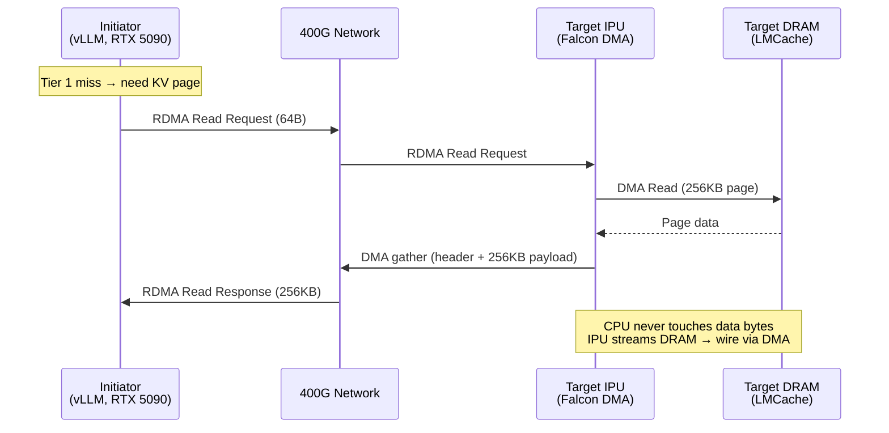

## Scenario 2: L1 Hit — NVMe/TCP Serve (Hot Path)

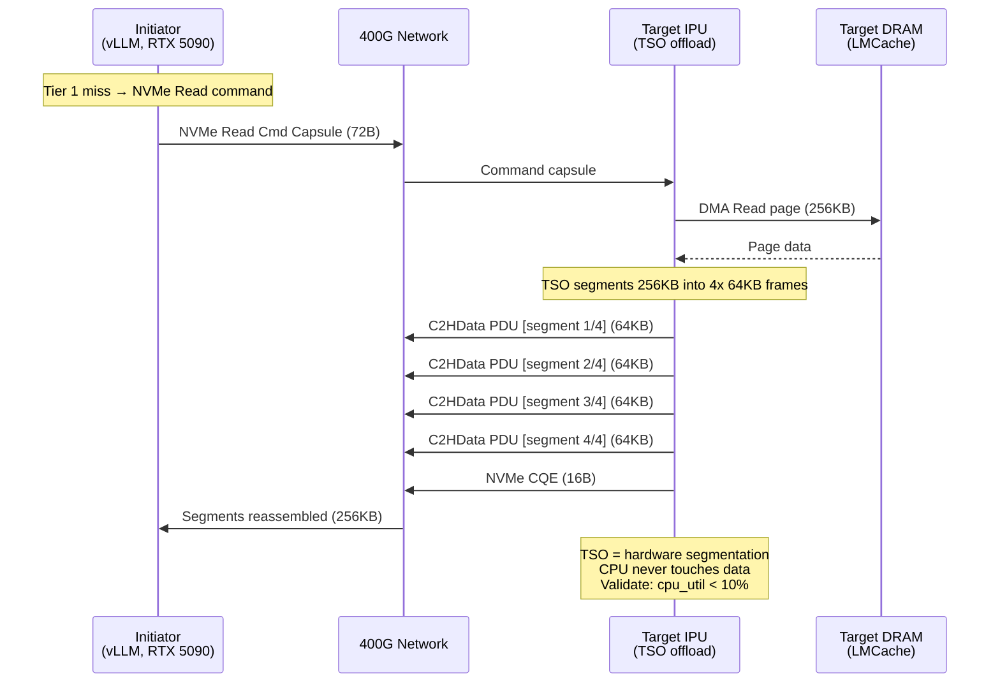

## Scenario 3: L1 Miss — SSD Fetch → RDMA Serve (Cold Path)

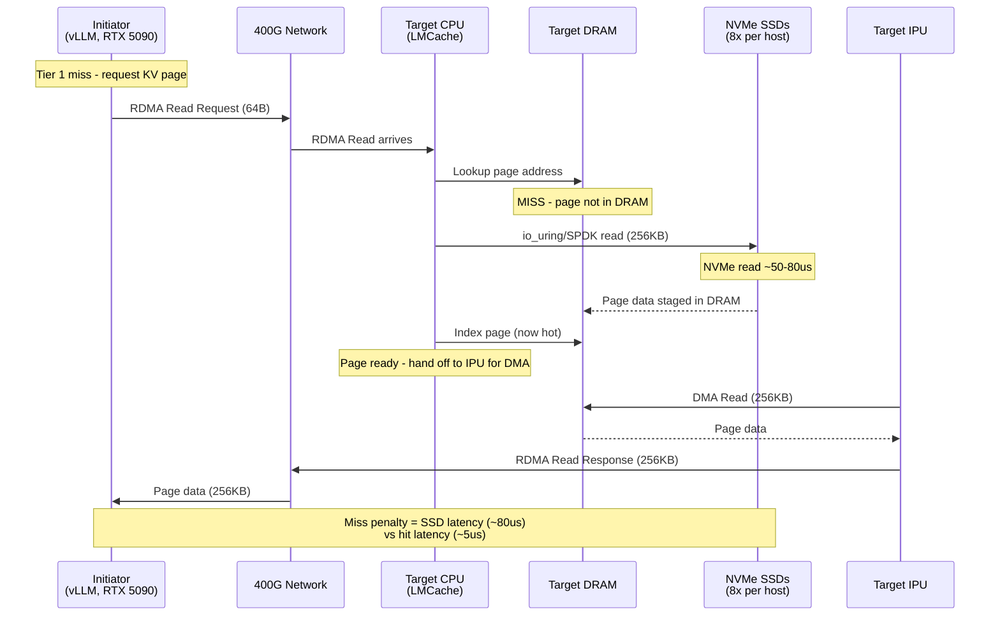

## Scenario 4: L1 Miss — SSD Fetch → NVMe/TCP Serve (Cold Path)

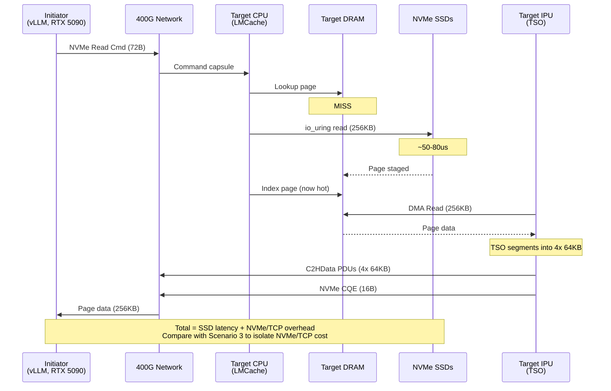

## Scenario 5A: Write — Raw RDMA Pull Model

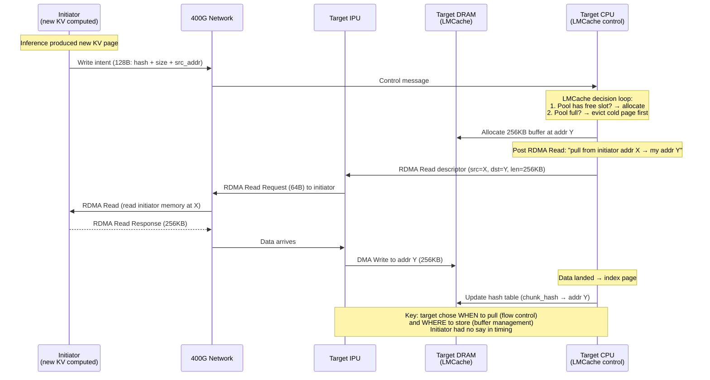

## Scenario 5B: Write — NVMe-oF Pull Model

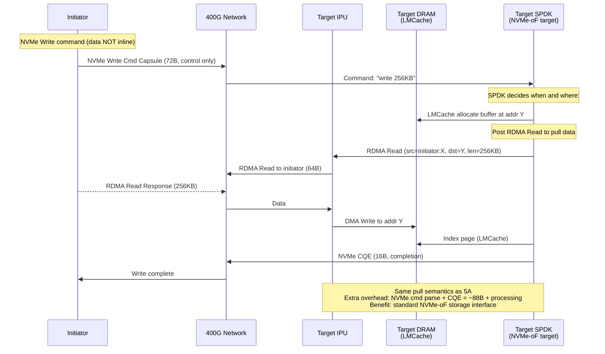

## Scenario 6: Write — NVMe/TCP Pull (R2T)

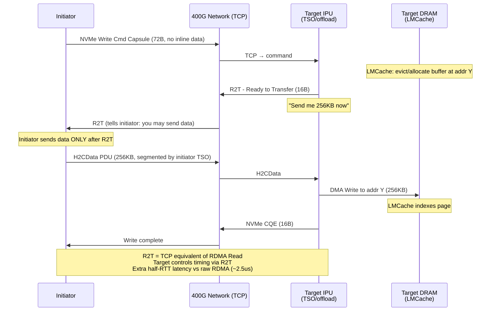

## Scenario 7: Mixed Read/Write (5:1 Steady State)

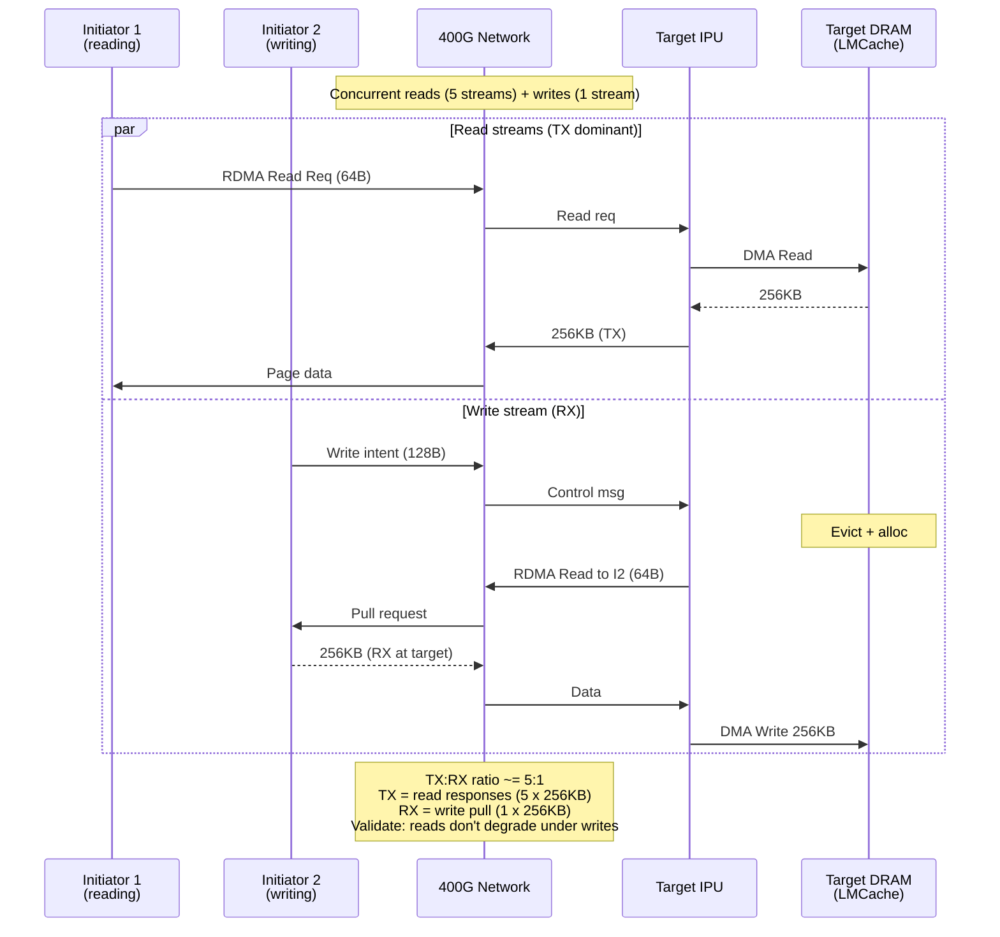

## Scenario 8: Eviction Pipeline (Full DRAM)

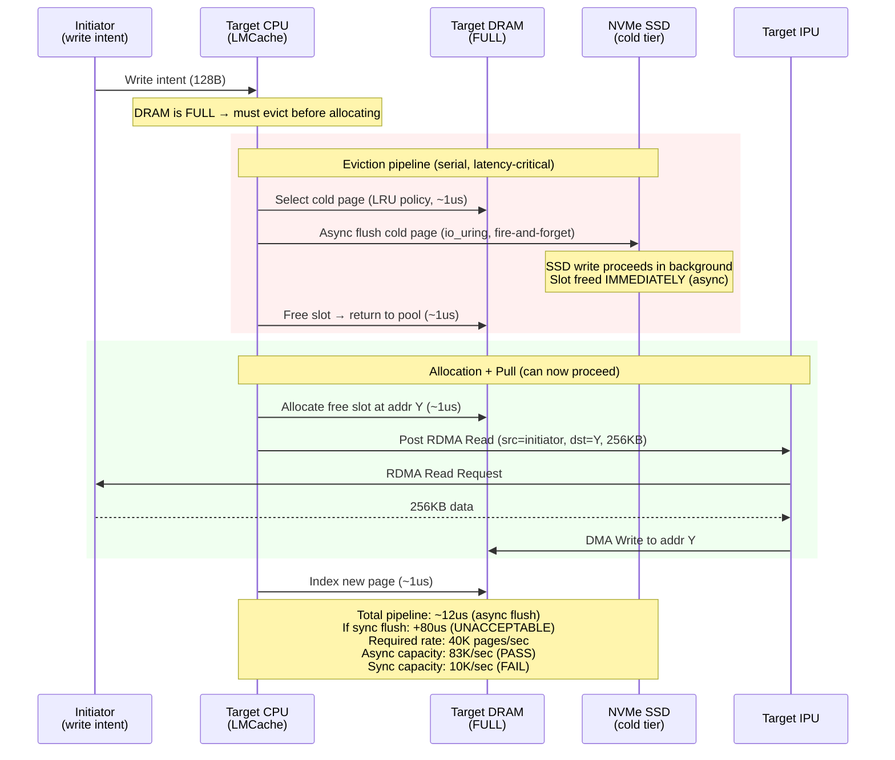

## Scenario 9: Multi-Initiator Write Flood

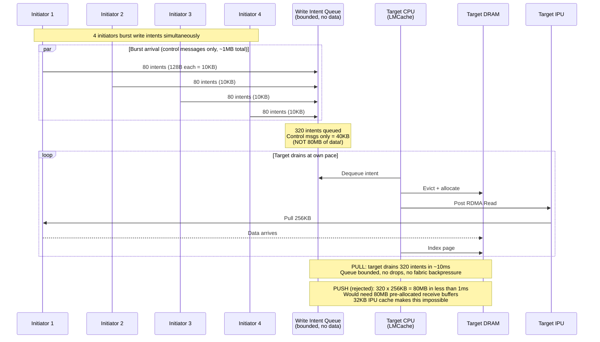

## Architecture Overview (All Scenarios)

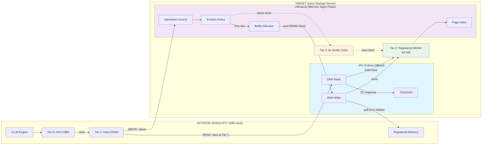

## Read vs Write Data Flow Summary

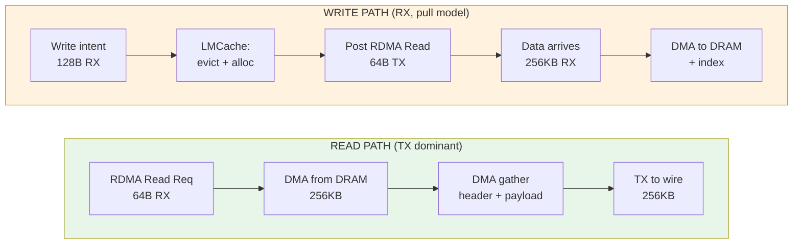
