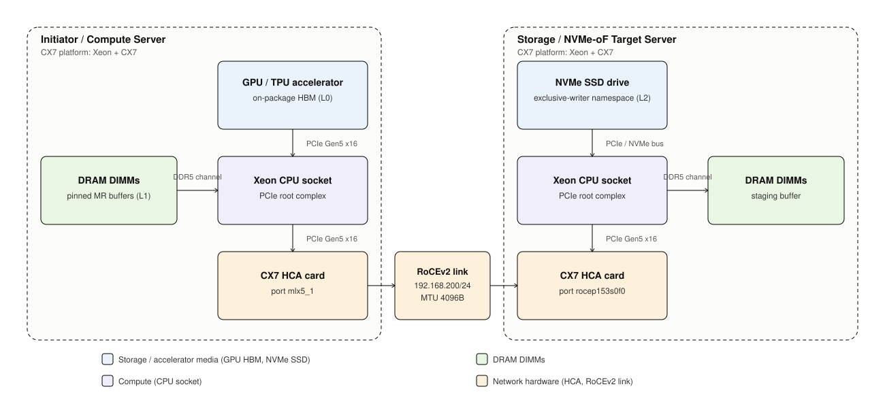

<!-- _class: title -->
<!-- _paginate: false -->

# Anthropic System Flows

## Architecture A enablement walkthrough

Initiator-owned cache semantics with remote NVMe-oF L2

 

**Purpose:** align silicon, firmware, software, and system teams on the
flows the platform must enable.

---

# What This Meeting Is For

## Walk through

- Where KV bytes and metadata move
- What completes each operation
- What an IPU may offload later
- Which platform assumptions need validation

## Not deciding today

- Architecture A versus B
- Final IPU endpoint selection
- Benchmark results or product claims
- Detailed POC execution plan

<strong>Working model:</strong> Architecture A keeps cache ownership on the
initiator. The IPU is a candidate transport engine, not a new cache owner.

---

# System View: L0, L1, L2

## Current CX7 baseline

- **L0:** GPU/TPU HBM, consumed by inference.
- **L1:** initiator Xeon DRAM, registered DMA buffers and local cache.
- **L2:** remote NVMe namespace, reached through NVMe-oF/RDMA.
- **Initiator Xeon:** LMCache, map, allocator, admission, WAL/recovery.
- **Target Xeon:** `nvmet-rdma` and SSD block layer; no LMCache agent.

The baseline intentionally puts no IPU on the data path. It establishes the
transport and cache contract that an IPU implementation must preserve.

---

# Retrieve Flow: Remote L2 to GPU/TPU HBM

<strong>1.</strong> LMCache resolves a key on the initiator. 
<strong>2.</strong> L2 read brings bytes over NVMe-oF/RDMA into registered
initiator DRAM. 
<strong>3.</strong> Initiator verifies the committed digest and promotes the
page to L1 as appropriate. 
<strong>4.</strong> GPU connector DMA moves the page from host DRAM to L0 HBM.

## Data path

L2 NVMe → fabric → L1 DRAM → L0 HBM

The byte path is staged through host DRAM in the current design.

## Enablement question

Can the platform move registered buffers and complete the transfer without
host CPUs loading, storing, or copying KV payload bytes?

---

# Store Flow: GPU/TPU HBM to Durable L2

<strong>1.</strong> GPU/TPU DMA stages a KV page in initiator DRAM. 
<strong>2.</strong> Initiator records intent, writes payload and checksum to
remote NVMe, then persists the commit record. 
<strong>3.</strong> Only after the commit barrier does it publish the new
key-to-LBA mapping and return the terminal ACK.

## Ownership stays on Xeon

Key hashing, admission, allocator, WAL, retry semantics, and recovery remain
initiator-owned.

## Platform-relevant boundary

The IPU may carry NVMe-oF transport and queue/completion work. It must not
silently change ordering, error visibility, or the meaning of ACK.

---

# Failure Flow: What Must Remain True

## Fabric failure

- In-flight I/O surfaces an error
- Link recovers at contracted parameters
- Initiator reconnects and replays
- No reduced-rate success is accepted as recovery

## Process restart

- Pre-commit writes do not become visible
- A committed generation reconstructs once
- Superseded extents are not reused too early
- Client retry remains idempotent

The offload design is acceptable only if it preserves these software-visible
outcomes, including the ordering of errors and completions.

---

# What Is Intentionally Not on the IPU

## Cache semantics

- LMCache Engine / StorageManager
- Key-to-LBA map and allocator
- WAL, replay, durable-ACK authority
- Admission, deduplication, eviction, multi-initiator coordination

## Cache residency

- GPU/TPU HBM management
- Host DRAM as the DMA staging area
- KV pages as an IPU-memory cache

The IPU streams payloads; its small local cache is not an L1/L2 extension.

<strong>Customer preference (2026-06-22):</strong> eliminate host-DRAM staging
on the payload path if achievable; do <em>not</em> substitute IPU local memory
as the staging tier. MMG-400's 32&nbsp;MB SRAM is too tight and treating it as
an L1/L2 extension is out of scope for this generation.

<strong>IPU role:</strong> offload byte movement and transport work, not cache
ownership.

---

# What Each Team Should Pressure-Test

## Silicon

DMA engines, queue/CQ scale, memory ordering, cache behavior.

## Firmware

Link recovery, error propagation, counters, reset boundaries.

## Software

API boundary, buffer registration, completion ownership, observability.

## System / board

IPU and SSD topology, NUMA, link rate, MTU, fault domains.

<strong>Discussion prompt:</strong> What platform constraint would invalidate
one of these flows or force a different software boundary?

---

# Follow-Up We Need From This Group

1. Identify any hardware, firmware, or board assumption that is false.
2. Confirm what evidence proves zero CPU payload touch on the chosen endpoint.
3. Identify required error, completion, and telemetry semantics.
4. Name owners for the IPU endpoint contract and platform topology.

No platform decision is requested in this meeting. The output is a concrete
enablement contract that lets the follow-on MEV/MMG work start without changing
the cache contract.

