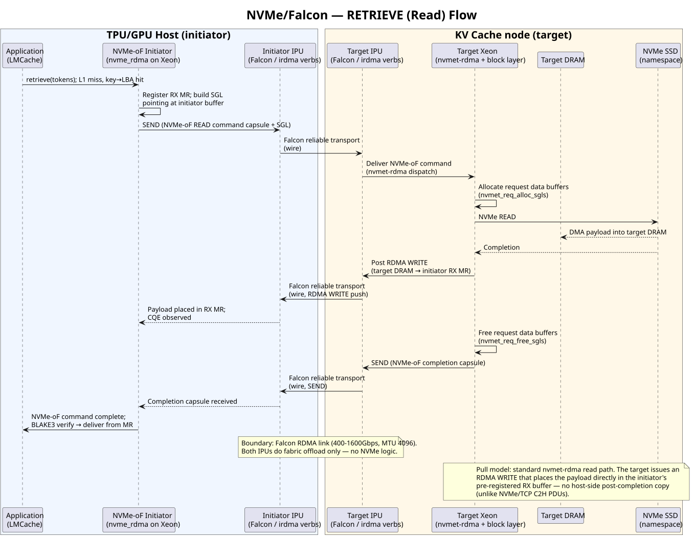
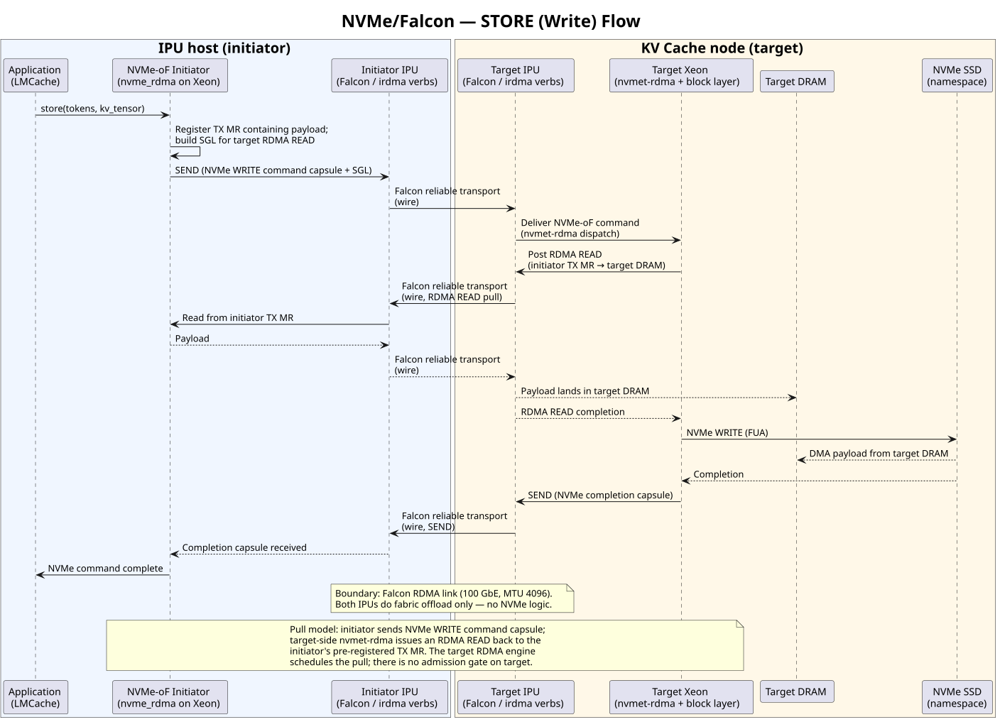

<!-- _footer: "IPU KV Cache PoC | Measured on one 100 GbE MEV link" -->

# Model-page remote L2 traffic reaches the 100 GbE wire ceiling

95.35 Gb/s

99.4% of the 95.92 Gb/s fio remote-NVMe ceiling

<strong>DeepSeek-V3 request geometry</strong> 
61 objects × 144 KiB per 256-token chunk = 8.58 MiB per submit

<b>82.29</b>W=16

<b>95.35</b>W=32

<b>44.26</b>W=64

The active tuning knob is <code>num_workers</code>, not
<code>--in-flight</code>.

<h2>Same link, same 32-worker budget</h2>
<ul>
<li>1 process × 32 workers: <strong>95.35 Gb/s</strong></li>
<li>2 processes × 16 workers: <strong>95.58 Gb/s</strong></li>
<li>4 processes × 8 workers: <strong>94.99 Gb/s</strong></li>
</ul>

<strong>Run configuration</strong> 
<code>fs_native</code>, W=32, <code>O_DIRECT</code>, in-flight 8, XFS on
md0 RAID0 over 2 NVMe-oF namespaces.

<strong>Evidence</strong> 
All pages completed; six fabric-error deltas were zero; corpus remained at
292,800 objects; counter ratios stayed within 0.9970–1.0060.

<strong>Classification:</strong> Falcon-offloaded kernel NVMe-oF, existing-controller, local multi-process <code>fs_native</code> sustained read. No unoffloaded control, fresh-QP, physical multi-initiator, 64-QP, 400 GbE, or mixed-read/write claim. Corpus: 40.2 GiB O_DIRECT re-read corpus, approximately 33 re-reads per 120 s window.

<!--
[Sources]
- scripts/ipu-poc/README-model-geometry.md: DeepSeek geometry, measured W=32,
  fan-in, integrity, and corpus-caveat data.
- fio raw remote-NVMe baseline in the same result record.
-->

---
<!-- _footer: "IPU KV Cache PoC | Retrieve path: measured and byte-verified" -->

# Retrieve places SSD data directly into initiator receive memory

<strong>1. NVMe-oF READ</strong> 
The capsule carries an SGL for the initiator receive memory region.

<strong>2. Read at the target</strong> 
SSD data reaches target DRAM through the target Xeon storage stack.

<strong>3. RDMA WRITE to the initiator</strong> 
The target posts the transfer into the supplied receive memory region.

The read path was measured at model-page geometry and
byte-verified. There is no host-side post-completion payload copy, unlike an
NVMe/TCP C2H path.

The diagram labels the Falcon interface range as
400–1600 Gb/s. This evidence is from one 100 GbE MEV link.

<!--
[Sources]
- diagrams/architecture-a-nvmeof-falcon-retrieve-flow.puml and .svg:
  Architecture A retrieve sequence.
- scripts/ipu-poc/README-model-geometry.md: measured and byte-verified
  read-path evidence.
-->

---
<!-- _footer: "IPU KV Cache PoC | Store path: transport mechanism exercised in prepopulation" -->

# Store pulls initiator data before writing it to SSD

<strong>1. NVMe-oF WRITE</strong> 
The capsule identifies the initiator transmit memory region.

<strong>2. RDMA READ at the target</strong> 
The target pulls the payload into target DRAM.

<strong>3. Target storage write</strong> 
The target Xeon writes the payload to the NVMe namespace.

Standard kernel NVMe-oF transport. No cache decision or
storage service runs on the IPU.

<strong>Current evidence boundary</strong> 
The mechanism ran during prepopulation. A byte-verified sustained 5:1 result is
still pending.

The diagram's 400–1600 Gb/s label is the interface range;
today's evidence is one 100 GbE MEV link.

<!--
[Sources]
- diagrams/architecture-a-nvmeof-falcon-store-flow.puml and .svg:
  Architecture A store sequence.
- scripts/ipu-poc/README-model-geometry.md: sustained mixed verification
  boundary.
-->

---
<!-- _footer: "IPU KV Cache PoC | Current 100 GbE evidence; future MMG scale-out plan" -->

# The 100 GbE proof point now drives the 4x400 GbE plan

<strong>Current proof point</strong> 
One 100 GbE MEV link reaches 95.35 Gb/s at DeepSeek-V3 model-page geometry.

<strong>Phase 1 target</strong> 
1x400 GbE, 256 KiB, 100% read, 64 aggregate QPs, at least 45 GB/s sustained
goodput.

<strong>Scale-out system</strong> 
2-socket Xeon owns <code>nvmet</code>/<code>nvmet_rdma</code>, target control,
and storage. 4x MMG-400 IPUs carry Falcon transport only. 16x Gen5 x4 NVMe
SSDs provide the target media.

<strong>4x400 GbE follow-on</strong> 
Requires at least 180 GB/s of local block and NVMe-oF loopback capacity before
the link result is meaningful.

Scale-out namespace-pool mapping. Each physical
initiator starts with its own 4-SSD pool; shared reads are immutable and mixed
writes use fresh, disjoint prefixes or namespaces.

<!--
[Sources]
- diagrams/mkp-fsnative-4x400-test-architecture.mmd and .svg:
  multi-initiator namespace-pool mapping.
- Anthropic NVMe-oF PoC plan: future 1x400 and 4x400 scope, hardware,
  64-QP headline cell, and scale-out capacity gate.
-->
