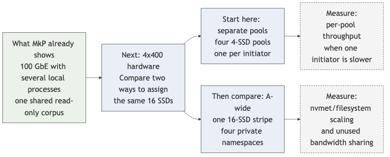

<!-- _class: title -->
<!-- _paginate: false -->

# LMCache Remote L2 Data Path with Intel IPU

## MEV 100 GbE kernel NVMe-oF over Falcon transport offload

August 2026

---
<!-- _footer: "IPU KV Cache PoC" -->

# Functional PoC: Workload and 100 GbE Link Validation

This CPU-buffered, `O_DIRECT` workload drives the remote-NVMe path from the
initiator host through the IPUs, target Xeon, and SSDs. It has sustained
line-rate 100% reads and generated an exact 5:1 read/write mix on the MkP
100 GbE Falcon link.

### What this PoC establishes

- Sustained remote-storage goodput with a working set larger than initiator DRAM
- 100% read and 5:1 read/write traffic generated by `bench l2`
- Submission and adapter-worker concurrency; `--in-flight` drives workload
  width rather than NVMe/RDMA QP creation

### Next hardware phase

- Apply the same workload to fresh-QP and physical multi-initiator scale-out
- Run the 64-QP, 256 KiB headline cell when 400 GbE hardware is available
- Extend from one 400 GbE link to four links and 16 SSDs

This is a functional remote-storage PoC. GPU staging and serving latency are
separate integration measurements.

---
<!-- _class: small -->
<!-- _footer: "IPU KV Cache PoC" -->

# 100 GbE Functional PoC Topology (Kernel NVMe-oF)

<pre><code>mkp1 (initiator)
  LMCache bench l2, one fs_native process, O_DIRECT
       ↓
  XFS on md0 RAID0 (256 KiB chunk)
       ↓
  kernel nvme_rdma: 2 existing controllers, 16 I/O queues each
       ↓  100 GbE direct IPU ↔ IPU, active_mtu=4096
  Falcon transport offload: idpf + irdma / rocep69s0f0
       ↓
mkp2 (target)
  kernel nvmet_rdma
       ↓
  PM9A3 nvme1n1 (NQN 1) + PM9A3 nvme2n1 (NQN 2)</code></pre>

### Functional coverage

- Full kernel storage path: `fs_native` → XFS → md0 → NVMe-oF →
  `nvmet-rdma` → two SSDs
- Host-buffered remote-L2 data path through the IPUs, target Xeon, and SSDs
- 34 established RC QPs are live: 2 controllers × (16 I/O + 1 admin)
- 303–400 GiB working sets exceed mkp1's 251 GiB DRAM; reads use `O_DIRECT`

### Why this is useful now

- Kernel NVMe-oF over Falcon transport offload at 100 GbE, through the
  existing controllers
- The workload and data path are held stable while submission concurrency and
  read/write mix change
- `fs_native` uses native C++ filesystem I/O, giving a direct remote-storage
  workload without GPU or serving-stack dependencies
- Fresh-QP and physical multi-initiator scale-out use this workload on the
  400 GbE hardware phase

---
<!-- _class: small -->
<!-- _footer: "IPU KV Cache PoC" -->

# FIO Baselines for the 100 GbE Read Path

| Surface | Read cell | Aggregate result | Interpretation |
|---|---|---:|---|
| Target local, 2 PM9A3 | random read, 256 KiB, QD 16 | **14.28 GB/s** | Local two-SSD ceiling |
| Initiator, raw remote namespaces | random read, 256 KiB, QD ≥16 | **11.99 GB/s** / 95.92 Gbps | NVMe-oF wire ceiling |
| Initiator, XFS on md0 | random read, 256 KiB, QD 64/256 | **11.98 GB/s** / 95.84 Gbps | Matched filesystem surface |
| Initiator, XFS on md0 | 28 MiB random read, numjobs 8/16 | **12.01/12.04 GB/s** | Payload-matched LMCache comparator |

### Controls that anchor the workload

- Aggregate writes plateau at **5.6 GB/s**: two-drive media limit, not fabric
- XFS costs at most 3% throughput against the raw remote surface at these QDs
- The 28 MiB numjobs=32 result (12.31 GB/s) exceeds the 4096-MTU wire model;
  it is retained but not used as a ceiling

### What the baselines establish

- The matched XFS/md0 surface sustains **95.84 Gbps**, setting the practical
  100 GbE reference for `fs_native`
- The `bench l2` read windows match that reference at **95.94 Gbps**
- 400 GbE runs will add synchronized per-SSD, target-CPU, and IPU telemetry

---
<!-- _class: small -->
<!-- _footer: "IPU KV Cache PoC" -->

# LMCache `bench l2` Sustained Read Saturates the 100 GbE Link

**100% read, 120 s measured window, `fs_native` + O_DIRECT, 303 GiB corpus:
the workload sustains the matched 100 GbE storage surface.**

| in-flight | Goodput | Keys successful | Submit p50 / p99 | `InRdmaWrites` ratio |
|---:|---:|---:|---:|---:|
| 4 | 95.63 Gbps | 48,857 / 48,857 | 9.8 / 15.0 ms | 0.9999 |
| 16 | **95.94 Gbps** | 49,024 / 49,024 | 41.1 / 67.3 ms | 1.0001 |
| 64 | **95.94 Gbps** | 49,072 / 49,072 | 157.2 / 186.5 ms | 1.0000 |

### Read result and RDMA counters agree

- The 28 MiB result matches its XFS/md0 fio comparator:
  **95.94 vs. 96.04–96.28 Gbps**
- The 4 MiB sustained read also reached **95.91 Gbps** with the same
  counter-validation gate
- A four-submit window already reaches 95.63 Gbps; 16 and 64 confirm the same
  link-limited plateau
- RDMA validation is independent of the app report: observed
  `InRdmaWrites` ÷ (app bytes ÷ 52,428) is within 0.01% of expected

### Supporting signals

- md0 carries the accepted application goodput across both remote namespaces
- All six RDMA error-counter deltas were zero: retransmits, NAK sequence,
  RTO, RNR, out-of-order, and protocol errors
- The 400 GbE phase adds synchronized per-NVMe throughput beside the existing
  application and RDMA-counter checks

---
<!-- _class: small -->
<!-- _footer: "IPU KV Cache PoC" -->

# Settings Used to Create a Repeatable 100 GbE Workload

These settings make the workload reviewable: payload, corpus, I/O path,
duration, and concurrency are explicit. The 100% read and 5:1 flows use the
same data path and validation model; only the operation mix changes.

| Dial | Value in the accepted sweep | What it controls | Why this value |
|---|---|---|---|
| `--only load` | load only | Direction of generated I/O | Measures the Falcon/NVMe-oF read path; the separately prepopulated corpus makes the measured cells read-only |
| `--data-size-kb` | `28672` | Payload per LMCache key | 28 MiB is a large-payload saturation proxy |
| `--num-keys` | `1` | KV chunks per adapter submit | Keeps one submit equal to one proxy chunk, so `--in-flight` is the only submission-width sweep axis |
| `--in-flight` | `4`, `16`, `64` | Outstanding user-space submits | Tests how much request concurrency is needed to fill the link; it does **not** create NVMe/RDMA QPs |
| `num_workers` | `16` | `fs_native` adapter worker pool | Held fixed so the sweep isolates submission concurrency; not claimed as a globally optimal worker count |
| `use_odirect` | `true` | Filesystem cache bypass | Ensures the measured reads reach the NVMe-oF path rather than succeeding from host page cache |
| `--rounds` | `11072 / in-flight` | Prepopulated load-wrap space | Holds the corpus at 303 GiB, above initiator DRAM, so repeated reads do not fit in memory |

### Results

- At 28 MiB/key, even four outstanding chunks carry 112 MiB of payload
- 4 / 16 / 64 in-flight reached 95.63 / 95.94 / 95.94 Gbps
- The smallest tested window, four in-flight submits, already fills the link

### Extension to scale-out

- The accepted 5:1 result uses the same remote-storage path and is shown next
- The current controllers are held stable while the workload shape is proven
- The 400 GbE phase distributes this workload across fresh QPs and physical
  initiators

---
<!-- _class: small -->
<!-- _footer: "IPU KV Cache PoC" -->

# LMCache `bench l2` Sustained 5:1 Mixed Window: Exact Mix, Reads 32 Gbps Below Line Rate

**28 MiB KV-chunk proxy, 120 s measured window, one process, existing controllers,
one global `--in-flight 16` window.**

| Read goodput | Write goodput | Aggregate | Achieved ratio | vs 100% read |
|---:|---:|---:|---:|---:|
| 63.89 Gbps | 12.78 Gbps | **76.67 Gbps** | **5.0000:1** | **-32.05 Gbps** |

### Run checks

- All 32,650 read keys and 6,530 write keys succeeded
- Three deterministic samples from the fresh write prefix were loaded back
  and matched their source buffers
- Read and write counter ratios were 0.99937 and 0.99940; all six fabric
  error-counter deltas were zero
- Target telemetry recorded both PM9A3s at about 100% utilization, with no
  SMART media-error or error-log delta

### Where the 32 Gbps went

Little's law over the shared 16-slot window:

| | compl/s | latency | slots |
|---|---:|---:|---:|
| reads | 272.0 | 51.68 ms | 14.06 |
| writes | 54.4 | 35.33 ms | 1.92 |

- **8.8 Gbps: slots taken by writes.** Reads held 14.06 of 16
- **23.2 Gbps: per-read latency inflation,** 39.2 ms read-only to 51.68 ms mixed
- So about 28% is harness accounting and 72% is the target

---
<!-- _class: small -->
<!-- _footer: "IPU KV Cache PoC" -->

# The 5:1 Read Deficit Is Media Contention, Not the Fabric

### The fabric is not the limiter

The duplex prediction held. Reads and writes occupy opposite directions, and
neither approaches its ceiling:

| Direction | Offered | Ceiling |
|---|---:|---:|
| read ingress | 63.89 Gbps | ~98 Gbps |
| write egress | 12.78 Gbps | ~98 Gbps |

All six fabric error counters were zero, so no fabric counter can explain the
deficit. Aggregate media traffic instead **fell** from 11.99 GB/s at 100% read
to 9.59 GB/s mixed: mixing costs 2.4 GB/s of media capability.

Two 0.25 s-resolution observations bound the cause. Throughput was flat across
the window (60.3, 64.7, 63.3, 64.1, 64.1, 63.6 Gbps by 20 s bucket), so this is
**not** SLC-cache exhaustion or progressive GC. And the 100% read sweep was
flat across in-flight 4/16/64, so the read path was already saturated.

### What to change, in order

1. **`fstrim` the XFS volume.** No `discard` option and no fstrim timer, with
   deleted prefixes still live to the FTL, so writes pay avoidable GC
2. **Split read and write in-flight budgets.** One shared window lets the mix
   silently change read concurrency, which also makes 5:1 and 1:1 not a
   controlled comparison
3. **Run a matched *mixed* fio comparator.** fio parity is established for
   reads only. This is the one test that says whether the gap is ours
4. **Preallocate the write corpus** and overwrite it, removing XFS allocation
   from the write path and the ~268 GiB/cell growth
5. **Add drives.** Read-only measured 6.0 GB/s per drive across two PM9A3s,
   leaving little headroom to hand to writes

Items 1 and 4 are storage hygiene, 2 and 4 are harness fixes, and 3 decides
whether to keep tuning. Item 5 says this may be a spindle-count problem rather
than a tuning problem.

**Unverified:** that 6.0 GB/s per drive is near the PM9A3 rated sustained read
figure. Confirm against the datasheet before treating item 5 as the conclusion.

---
<!-- _class: small -->
<!-- _footer: "IPU KV Cache PoC" -->

# Local Multi-Process Fan-In: Workload Coordination for Scale-Out

| Current local test | 2/4 `bench l2` processes on mkp1, same immutable `ds28m` corpus |
|---|---|
| 4-process result | **95.9436 Gbps**, 1 ms measured-start skew, all keys succeeded |
| Why aggregate throughput is flat | A single process already fills the one 100 GbE path |

Two and four `bench l2` processes read one immutable corpus through the
existing controllers. This validates coordinated local workload generation
before the same process model is placed on physical initiator hosts. The
mixed runner retains separate read and write accounting for the future 5:1
multi-initiator run.

### What this demonstrates

- Independent LMCache adapter instances concurrently load the same 303 GiB
  `fs_native` corpus through existing NVMe-oF controllers
- No misses, corpus mutation, or RDMA error-counter deltas in the accepted runs
- This establishes local process fan-in over one immutable read-only corpus

### Multi-initiator scaling model

- Independent LMCache instances begin with exclusive namespace pools
- The accepted local reader test shows that several instances can share an
  immutable corpus without misses or corruption
- The 400 GbE hardware phase moves these independent workloads onto physical
  initiators while retaining disjoint namespace ownership

---
<!-- _class: small -->
<!-- _footer: "IPU KV Cache PoC" -->

# From the 100 GbE Functional PoC to Hardware Scale-Out

| Stage | Hardware and workload | What it establishes |
|---|---|---|
| **Current functional PoC** | One 100 GbE MEV link; established controllers; CPU-buffered `fs_native` | Line-rate 100% reads, local multi-process fan-in, and an exact 5:1 mix whose read deficit is media-bound |
| **Next hardware phase** | One MMG-400 link; physical initiators; 256 KiB, 100% read, 64 aggregate QPs | The 400 GbE headline cell and per-initiator/QP characterization |
| **4x400 follow-on** | Four MMG-400 links and 16 SSDs; repeat the validated workload | Array, PCIe, memory, and target-CPU scaling toward 1.6 Tb/s |

For the hardware phases, initiators are independent load generators. Give each
initiator exclusive namespaces and split the 64 QPs evenly. Four 100 GbE
initiators are the minimum offered load; add a fifth if measurement shows that
four do not leave enough headroom to fill the target link.

---
<!-- _class: small -->
<!-- _footer: "IPU KV Cache PoC" -->

# 4x400 Hardware Phase Starts with Disjoint Namespace Pools

When the hardware is available, begin with four disjoint four-SSD pools, each
exclusively owned by one initiator. This preserves the shared-nothing workload
model validated by the functional PoC.

Then compare A-wide: one 16-SSD stripe with private namespaces. The comparison
separates storage-array scaling from per-initiator isolation and skew.

---
<!-- _class: title -->
<!-- _paginate: false -->

# Backup

Reference architecture, historical bring-up, and decision context.

---
<!-- _class: small -->
<!-- _footer: "IPU KV Cache PoC" -->

# Architecture Context

This PoC measures Architecture A: LMCache keeps cache state on the initiator
and uses remote NVMe-oF as L2. It does not test a target-side cache service.

| | Architecture A | Architecture B |
|---|---|---|
| Storage role | Passive NVMe-oF namespace | Cache service with hash, admission, and eviction |
| Cache state | Initiator-owned | Target-owned |
| Data protocol | NVMe-oF capsules | Raw RDMA verbs |
| Multi-initiator dedup | Not provided | Global target index |
| IPU role | Accelerate or replace NVMe-oF endpoint work | Run target cache and admission work |

Durable publication for A is target design work: the current `raw_block`
adapter does not provide WAL ordering or crash-safe map publication.

---
<!-- _class: small -->
<!-- _footer: "IPU KV Cache PoC" -->

# `bench l2` and vLLM Answer Different Questions

`bench l2` is intentionally a microbenchmark. It controls offered load so the
remote-L2 transport and storage path can be measured independently.

### What the current benchmark exercises

- CPU buffers and deterministic `ObjectKey` values
- Configured payload, 100% read or 5:1 mix, and a sustained in-flight window
- The real `fs_native` → O_DIRECT/XFS/md0 → `nvme_rdma` → Falcon →
  `nvmet-rdma` → SSD path
- Application goodput, data verification, and RDMA counter agreement

### What vLLM adds

- Token-derived keys, prefix-cache hit rate, admission, and eviction
- Request arrivals, batching, scheduling, and decode/prefill interaction
- GPU HBM to host-memory staging and its PCIe or NVLink cost
- Serving outcomes such as TTFT and tokens per second

**Use the results accordingly:** `bench l2` shows whether the configured
Falcon/NVMe-oF/SSD path can carry the agreed workload. A vLLM run shows whether
that path improves serving.

---
<!-- _class: small -->
<!-- _footer: "IPU KV Cache PoC" -->

# Host and IPU Roles (Target Design)

<pre>
INITIATOR NODE                              TARGET (NVMe-oF) NODE
──────────────                              ─────────────────────

Initiator Xeon (cache state):               Target Xeon (transport + block):
 • LMCache engine, token hashing              • Linux nvmet + nvmet-rdma, NQN ACL, namespace export
 • L1 management, L2 allocator, key→LBA map   • Linux kernel block layer, SSD driver
 • WAL, checksum, recovery                    • No LMCache, hash table, admission, or LRU
 • Issues NVMe-oF I/O; returns final ACK      • SSD is the durable L2 medium

Initiator IPU (D-init or D-both):           Target IPU (D-tgt or D-both):
 • Terminates the initiator path              • Terminates the target path
 • Replaces or accelerates nvme_rdma          • Replaces or accelerates nvmet-rdma
 • No cache logic, WAL, or map                • No cache logic, WAL, or map
</pre>

The current MEV result uses the kernel NVMe-oF path. Endpoint replacement or
acceleration is future work; cache semantics remain on the host.

---
<!-- _class: small -->
<!-- _footer: "IPU KV Cache PoC" -->

# Target Design: Architecture A Store

<pre>
LMCache (Init Xeon)         Init nvme_rdma      NVMe-oF/RDMA      Target nvmet-rdma        SSD (L2)
───────────────────         ──────────────      ────────────      ─────────────────        ────────
1. store(tokens, kv)
2. GPU HBM → init DRAM
3. Hash → BLAKE3 D;
   {key,D} idempotency
4. L1 put(key, PENDING)     (not lookup-visible)
5. WAL intent + FLUSH  ──► NVMe WRITE+FLUSH ──►                ──► write+flush ──►         intent durable
6. Payload (FUA, 256K) ──► NVMe WRITE ────────►
                           ◄── RDMA READ ─────                 (target pulls init MR)
                           ──── 256K payload ─►                ──► block write+FUA ─►      payload durable
7. Checksum (FUA)     ───► NVMe WRITE (FUA) ──►                ──► write+FUA ─────►       cksum durable
8. WAL COMMIT + FLUSH ───► NVMe WRITE+FLUSH ──►                ──► write+flush ──►         commit durable
                           ◄── flush cqe ─────                                              c5 BEGINS
9. Publish key→LBA + L1 PENDING→VISIBLE (atomic)                                            c5 ENDS
10. Terminal ACK
</pre>

### c5 window (step 8 cqe → step 9)

COMMITTED record durable on media, map/L1 not yet flipped. Recovery
reconstructs the new value from the WAL exactly once. Fault-matrix
test T4 exercises this boundary.

### ACK-loss retry

Keyed on `{key, digest}`: absent → start; PENDING → join / retry;
VISIBLE → no-op success; different digest for same key → reject.
Never allocate or WAL-write twice.

**Wire direction ≠ pull semantics.** `nvmet-rdma` issues the RDMA
Read at step 6 as its normal transport implementation of the NVMe
Write. No target-side cache decision precedes it. Architecture B is
the pull-with-admission model.

---
<!-- _class: small -->
<!-- _footer: "IPU KV Cache PoC" -->

# Target Design: Architecture A Retrieve

<pre>
LMCache (Init Xeon)         Init nvme_rdma      NVMe-oF/RDMA      Target nvmet-rdma        SSD (L2)
───────────────────         ──────────────      ────────────      ─────────────────        ────────
1. retrieve(tokens)
2. Hash tokens → BLAKE3 keys
3. L1 lookup (exclude PENDING)

L1 HIT:  get from L1 → DMA to GPU HBM → resume    (no fabric traffic)

L1 MISS → key→LBA map lookup:
  L2 HIT:  4. io_uring NVMe read (O_DIRECT, 256K)
                          ─── NVMe READ ────►                    ── read ──►                return block
                          ◄── 256K RDMA WRITE ──                 (target → init MR)
           5. Recompute BLAKE3; compare to committed digest
              OK:   optional promote to L1, DMA to GPU HBM
              FAIL: mark stale, discard map entry, return miss
  L2 MISS: return miss → caller recomputes KV
</pre>

 

**No target-side lookup, hash table, admission, or L1 branch.**
The target only serves NVMe-oF commands and moves blocks to/from
the SSD.

---
<!-- _footer: "IPU KV Cache PoC" -->

# Architecture A Historical Delivery Stages (2026-07-23)

**Historical plan, not current delivery status.** The fresh-QP/perftest
gate remains blocked; the existing-controller 100 GbE benchmark is scoped
separately.

Stages 0–5 were planned for the MEV lab (Intel IPU, PCIe Gen4, 1x 100 GbE
Falcon; 2x Samsung PM9A3 Gen4 SSDs on the target — sized to saturate
100 GbE on the read path). CX7 is a completed reference baseline. The
future endpoint-replacement experiment and MMG are separate follow-on
plans.

- **Stage 0** — Freeze contract (namespaces, NQNs, ownership); pass all
  §5.2 gates including Falcon/perftest sanity and fabric fault-injection
  capability
- **Stage 1** — Prove safe NVMe-oF lifecycle over `irdma`/Falcon (T1).
  **Two-week abort rule:** if `nvme_rdma`/`nvmet_rdma` over `irdma`
  doesn't work in that window, D2-kernel-path aborts and the plan
  pivots to a userspace-target/initiator revision
- **Stage 2** — Remote-L2 I/O baseline (block-I/O sweep, SHA-256 verify)
- **Stage 3** — WAL-based durable publication (intent → payload+FUA →
  checksum+FUA → commit+flush → publish → ACK)
- **Stage 4** — Two tracks: T4 crash matrix at all 6 A.3 cutpoints
  (incl. c5 committed-but-not-visible) + T5 fabric-fault matrix on
  named in-flight NVMe operations
- **Stage 5** — LMCache integration + workload evidence; **T7 MEV
  kernel-path baseline** for the future endpoint-replacement experiment
  (same hardware) and MMG (cross-platform reference)

 

Architecture B proceeds separately.

---
<!-- _class: small -->
<!-- _footer: "IPU KV Cache PoC" -->

# Open Architecture Decisions

### Architecture choice

Does the target need cache-level decisions (dedup, admission, LRU)
BEFORE serving data, or is a passive NVMe-oF namespace acceptable?

An NVMe-oF target's RDMA Read to fetch a Write payload is standard
transport behavior, not cache-semantic pull.

→ Cache-level admission required: prioritize B.
→ Otherwise: A stays eligible.

### Software stack for A

Linux kernel `nvme_rdma` / `nvmet-rdma` (fastest validation), or
SPDK userspace (max control over polling, queueing, CPU)?

Preference may differ per endpoint (initiator vs target).

### Success criteria

- Min host-CPU reduction at comparable throughput
- Max p99 latency regression for small I/O
- Max sustained-throughput regression for large I/O
- Reconnect-timeout ceiling; time-to-cache-online after cold restart

### Decision workload

Read-heavy retrieval, write-heavy durable store, or a mixed
KV-cache trace?

---
<!-- _class: small -->
<!-- _footer: "IPU KV Cache PoC" -->

# Stage 2 Bring-Up Retraction: Read Failures Were Timed as Success

**Historical finding.** mkp1 (initiator) ↔ mkp2 (target), 100 GbE Falcon,
md0 RAID0 + XFS on 2× PM9A3, 28 MiB large-payload saturation proxy,
`O_DIRECT`.

### What happened

- **Writes moved data over the wire; reads did not.** The test was corrected
  before any read performance claim was accepted.
- Read cell reported **7,746 ops/s at c=1** (≈ 228 GB/s — impossible on
  100 GbE).
- RDMA counters: the write phase moved 15.03 GB; the read phase moved zero.
- Every read was an `EINVAL` from `O_DIRECT` `readinto`.

### Root cause

- The read destination tensor was not page-aligned.
- The read helper swallowed `OSError`, returned `None`, and the harness timed
  elapsed time regardless of success or failure.

### Correction

1. Page-align the read buffer.
2. Invalidate cache between write and read phases.
3. Count failures and fail the run on any failed read.

The reported **6.21 GB/s O_DIRECT read** and its fio comparison were retracted.
The 2.66 GB/s single-drive write observation remains, without a matched fio
comparison.

---
