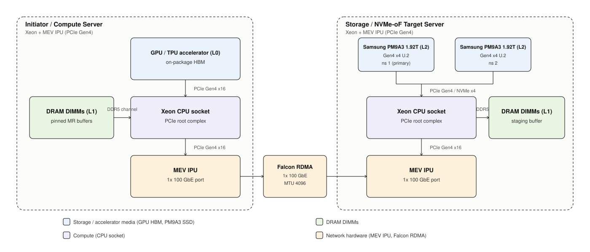
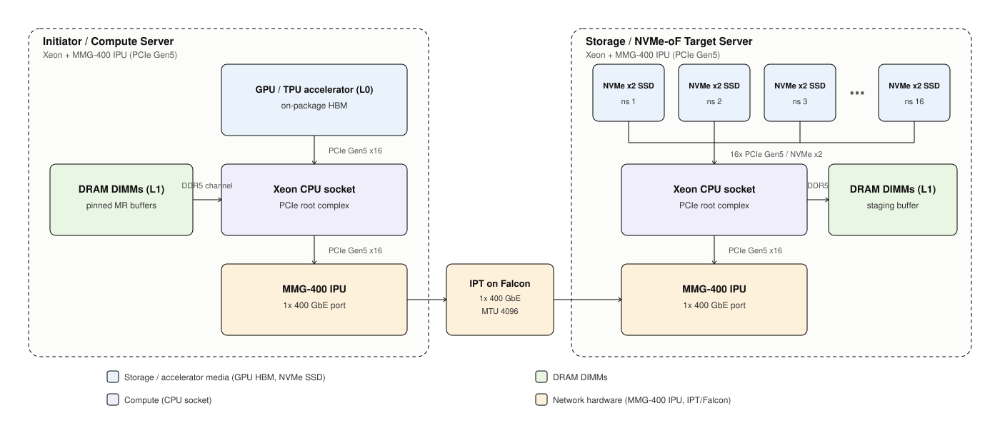

# Inference KV Cache Offload with Intel IPU

*LMCache remote tiering over RDMA/Falcon; preliminary MEV bring-up
against the completed CX7 reference baseline*

## 1. Executive Summary

This plan brings up the initiator-owned NVMe-oF software stack on the
MEV platform (Intel IPU, PCIe Gen4, 1x 100 GbE, Falcon transport):
two hosts, kernel `nvme_rdma`/`nvmet_rdma` over `irdma` verbs, and
**2x Samsung PM9A3 Gen4 SSDs** on the target -- the count needed to
saturate the 100 GbE link on the read path (sizing math in §5.1). No IPU
offload endpoint is on the data path yet -- this preliminary work
proves Architecture A runs correctly on MEV silicon and captures the
MEV kernel-path baseline (T7) that the later offload phase (D-init /
D-tgt / D-both, Appendix D) compares against on the same hardware.

The CX7 work that preceded this plan is retained as a completed
reference baseline (environment in D.5). Its T7 numbers remain
useful as a cross-platform sanity reference, but the offload
comparison that matters is same-platform: MEV offloaded path vs the
MEV kernel path measured here.

**Architecture A** puts all cache semantics on the initiator:
key->LBA map, WAL, allocator, admission. The target is a dumb
nvmet-rdma exporter. This is the customer-requested path to test
whether an IPU can reduce transport CPU cost without degrading cache
behavior.

**What we ship.** Two deliverables, both on the MEV lab:

- **D1 -- Raw NVMe-oF Baseline.** Can we safely attach, detach, and
  reconnect remote namespaces and push deterministic I/O through
  them at known latency/throughput -- over `irdma` on Falcon? No
  LMCache in the path. No durability claims. Stages 0-2.

- **D2 -- Durable Remote-L2.** LMCache integration with the WAL
  commit protocol (Appendix A), crash recovery across all six
  cutpoints, an integrated workload (T6), and the MEV kernel-path
  host-CPU baseline (T7) the offload phase compares against.
  Stages 3-5.

**What happens after this plan.** The MEV offload phase selects an
endpoint (D-init / D-tgt / D-both, Appendix D.2) and re-runs the
comparison workloads against this plan's T7 baseline on identical
hardware. MMG follows when its silicon and Falcon enabling are ready
(anticipated early August 2026). Both are separate plans; the
contract items are in Appendix D, not milestones here.

**Platforms at a glance:**

| Platform | Silicon | Wire transport | Status |
| --- | --- | --- | --- |
| CX7 | Mellanox CX7 on Xeon (Granite Rapids AP) | RoCEv2 | Completed reference baseline (D.5) |
| MEV | Intel IPU, MEV release | Falcon reliable transport | **This plan** (kernel path, 2 SSDs); offload phase follows |
| MMG | Intel IPU, MMG-400 | IPT on Falcon cores | Follow-on plan; ~August 2026 |

**Principal risks.** The customer-reportable baseline stops if
kernel `nvme_rdma`/`nvmet_rdma` do not run correctly over `irdma`
verbs on Falcon (the MEV stack has been proven with perftest, not
with the kernel NVMe-oF path), if the fabric cannot negotiate
`IBV_MTU_4096`, or if the fault harness cannot prove it interrupted
established NVMe-oF I/O in the stated order. MEV-TS feature-pack and
driver churn can invalidate in-progress runs; the manifest pins the
release per run.

**Decisions needed.** At kickoff, the customer confirms any workload
alternate and the T6 L1-hit-rate tolerance. Before the offload phase starts, Nima selects
the offloaded endpoint (D.2) and resolves the production-topology
question in D.3; neither blocks this plan's bring-up.

The three possible outcomes after all platform evidence is in:
**advance A** (it works, ship it), **optimize A** (correctness
passes but WAL fast-path or allocator batching needs targeted work),
or **abandon A** (fails a functional/durability gate or neither
baseline nor IPU delta shows realistic headroom). This plan produces
the MEV kernel-path input; the call itself waits for the offload
phase and MMG.

**Terminology.** L0 = GPU HBM. L1 = initiator host DRAM. L2 = remote
NVMe namespace via NVMe-oF/RDMA. These labels are stable throughout
the doc and across all three platforms.

## 2. Customer Requirements and Traceability

| ID | Requirement | Evidence |
| --- | --- | --- |
| R1 | LMCache runs only on the initiator; target exports NVMe-oF namespaces, no LMCache agent | Target process list and `nvmet-rdma` config at kickoff |
| R2 | One initiator exclusively owns the exported namespaces (2 SSDs, one namespace each; no other host NQN on the ACL) | Single-host NQN ACL + pre-attach namespace check on both namespaces |
| R3 | Every successful load matches its recorded BLAKE3 checksum | Read-path integrity verification |
| R4 | Results reproducible from a versioned manifest | Manifest records topology, versions, commands, artifacts |
| R5 | MEV kernel-path results are the baseline for the offload-phase comparison | T7 captures host CPU, `nvme_rdma` MR/QP churn, CQ event rate on the `irdma` path |

## 3. Architecture A vs B

We are running A. The table below is context for readers who need to
understand where A sits relative to B; it is not a decision this plan
makes.

The short version: A is simpler and safer (no target agent, no
distributed lease/admission control, smaller fault domain). B gets you
multi-initiator dedup and server-side admission, which matters at
scale but introduces a distributed control plane we don't want in
scope for the first IPU offload measurement. A and B measure
fundamentally different things -- A exercises the transport surface,
B exercises cache control-plane placement -- so comparing raw numbers
between them without a shared workload contract is misleading. Any
A-vs-B decision needs a separate cross-architecture experiment; this
plan won't be the input to that.

| Dimension | A: Initiator-owned NVMe-oF | B: Storage-owned RDMA + LMCache server |
| --- | --- | --- |
| Cache semantics | Initiator only | Target-side LMCache agent |
| Storage node role | Passive `nvmet-rdma` | Smart cache (hash, admission, eviction) |
| Fault domain | Initiator + fabric + target block layer | + target cache control plane |
| Durability authority | Initiator WAL + NVMe FUA/FLUSH | Target agent + NVMe |
| Multi-initiator dedup | Out of scope (exclusive namespace) | Yes (global hash index) |
| IPU offload opportunity | Initiator HCA verbs/MR/QP + target `nvmet-rdma` termination | Target-side agent + admission |
| Distributed-systems risk | Low | Higher (lease, quorum, control-plane liveness) |

## 4. Architecture A Topology and Component Roles

The design idea is simple: the initiator owns everything that matters
(WAL, allocator, key->LBA map, admission, integrity metadata), and
the target is a block device you happen to reach over a fabric instead
of a local PCIe bus. No agent on the target, no cache-level decisions,
no coordination protocol. If the target crashes mid-write, the
initiator's WAL replays to a consistent state. If the fabric drops, the
initiator reconnects and replays. The target never needs to know what
a KV cache is.

This is true across all three platforms. In this plan the Linux
NVMe-oF/block-I/O path is preserved end to end -- kernel `nvme_rdma`
and `nvmet_rdma` over `irdma` verbs, with Falcon underneath as the
wire transport. Whether the offload phase replaces that path with
IPU-hosted transport is an explicit software-architecture choice made
per endpoint in Appendix D, not something Architecture A dictates.

One thing worth calling out about wire direction: on an NVMe Write,
`nvmet-rdma` issues an RDMA Read to pull the payload from the
initiator's registered buffer. This is standard NVMe-oF transport
behavior, not target-side admission. The target never decides
*whether* to accept the data; it just moves bytes to the SSD.
Target-side cache semantics (the admission-then-pull model) is
Architecture B.

*Two Xeon + MEV IPU servers (Inspur NF5280M7, PCIe Gen4) connected
over a single 100 GbE Falcon RDMA link; the target carries 2x
Samsung PM9A3 Gen4 x4 SSDs, one namespace each. Media in blue, host
CPU in purple, DRAM in green, IPU/fabric hardware in amber. The CX7
reference topology is
`diagrams/architecture-a-cx7-hardware-topology.svg`.*

### 4.1 Initiator (compute) host

| Component | Role |
| --- | --- |
| Xeon host CPU | Runs LMCache engine, StorageManager, WAL/map authority, allocator, admission. The brain. |
| GPU HBM (L0) | Consumes KV pages via DMA from initiator DRAM. Not on the NVMe-oF path. |
| Initiator DRAM (L1) | Pinned buffers for RDMA MR registration and GPU DMA. |
| MEV IPU (`irdma` verbs device) | Terminates NVMe-oF/RDMA transport over Falcon. Registers MRs for I/O buffers and the WAL log. CX7 HCA fills this role in the reference baseline. |
| Linux NVMe-oF initiator | `nvme-cli`, `nvme_rdma`. Fabric attach, path discovery, reconnect. Kernel-owned in this plan; the offload phase decides per endpoint whether to keep or replace it (Appendix D). |

### 4.2 Target (storage) host

| Component | Role |
| --- | --- |
| Xeon host CPU | Runs `nvmet-rdma`, configfs orchestration, SSD block layer. **No LMCache agent. No cache decisions.** |
| Host DRAM | Payload staging for `nvmet-rdma` and block layer only. Not an LMCache tier. |
| Target HCA | Terminates NVMe-oF/RDMA target transport. |
| 2x Samsung PM9A3 1.92 TB (L2) | Gen4 x4 U.2, one namespace per SSD (ns1, ns2), both ACL'd to the single initiator; ns1 is the primary durability-test namespace, ns2 joins the fabric-saturation sweeps and proves dual-namespace export/lifecycle. Count sized to saturate 100 GbE on reads (§5.1). Durable authority for stored bytes; wear-leveling, GC, FUA/FLUSH are the drive's problem. |

### 4.3 Fabric and non-participants

MEV data plane: single 100 GbE direct-attach link (the MEV IPU
exposes one 100 GbE port), Falcon reliable transport on the wire
with RoCE-style verbs on top. Management access stays off the data
path and is never reconfigured or used as a fault-injection target.
Management plane: 10.166.87.x / 10.166.86.x -- SSH only, never
touched, never a fault-injection target. The CX7 reference planes
are in D.5; MMG defines its own (D.6).

**Not participating:** target-side LMCache agent (removed by design),
IPU offload endpoints (offload-phase scope -- the IPU here acts only
as the `irdma` verbs device under the kernel path), multi-initiator
coordinator (out of scope and likely a separate project if we ever
need it).

Topology diagram: `diagrams/architecture-a-mev-hardware-topology.mmd`
(MMG anticipated: `diagrams/architecture-a-mmg-hardware-topology.mmd`;
CX7 reference: `diagrams/architecture-a-cx7-nvmeof-topology.mmd`).
WAL sequence: `diagrams/architecture-a-nvmeof-wal-sequence.mmd`.

### 4.4 Namespace layout and LMCache consumption

The target exports each SSD as its own NQN and namespace (`ns1`, `ns2`),
both ACL'd to the single initiator per R2. No RAID, no LVM, no filesystem
on the target — `nvmet-rdma` operates directly on the block device.

The initiator sees the two remote namespaces as independent NVMe
controllers via `nvme_rdma`. LMCache consumption is split by
deliverable: D1 (throughput baseline) and D2 (durable-remote-L2 with
Appendix A WAL) have **different storage-config requirements**, and
this section treats them separately.

#### 4.4.1 D1 throughput baseline — RAID 0 on the initiator

For D1, kernel RAID 0 across the two remote namespaces is the
throughput vehicle: `mdadm --level=0`, one filesystem on `/dev/md0`,
`LMCACHE_LOCAL_DISK="/mnt/md0/kvcache"`. Uses `LocalDiskBackend`
unchanged. Upstream docs
(`docs/source/kv_cache/storage_backends/local_storage.rst`) endorse
this for throughput. Rationale for D1 scope only:

- Aggregates bandwidth across both drives for a single-worker
  initiator without requiring any LMCache change.
- Measured DDIO health on the direct block devices is clean at QD ≤ 64
  (see `results/mkp1-mkp2-baseline-2026-08-02.md`); the RAID stripe
  unit still needs to be validated with LMCache in the path before
  citing DDIO friendliness under the actual workload.

**Explicit D1-only limitations:**

- `LocalDiskBackend` gives filesystem-durable file writes plus an
  in-memory metadata map. It does **not** deliver the Appendix A
  durable key→LBA map or WAL replay. This option is a throughput
  vehicle, not a D2 durability path.
- One namespace loss destroys the whole `md0` volume — every
  acknowledged cache entry becomes unavailable. Compatible with
  "ACK means recoverable" only if that guarantee is explicitly scoped
  to **process and fabric failure with intact media**. Any
  media-loss policy is out of scope for D1.

#### 4.4.2 D2 durable path — separate design decision, not settled here

D2 requires the Appendix A durable key→LBA map, WAL, and crash
recovery. `LocalDiskBackend` in its current form does not provide
this. Three shapes remain open, each with different LMCache-side
work:

- **D2-a:** Extend `LocalDiskBackend` with a durable metadata store
  and WAL, keep RAID 0 for the payload region. Simplest to explain,
  worst for media-loss failure domain.
- **D2-b:** New backend that treats each remote namespace as its own
  shard, per-shard WAL and metadata, key-hashed placement (see
  4.4.3 option 3). Best failure domain, most implementation work.
- **D2-c:** Raw-block backend (`lmcache/v1/storage_backend/raw_block/`)
  bypasses the filesystem entirely and manages LBA allocation from
  LMCache. Preserves durability model, requires plumbing for
  multi-namespace layout.

The D2 selection is not made in this document. It is a follow-on
design decision informed by the D1 numbers and by whether upstream
LMCache absorbs the required durability protocol. Filed as an open
item in §11 Future Work.

#### 4.4.3 Sharding strategy alternatives (not adopted for D1)

Two initiator-side alternatives to RAID 0, documented for
completeness:

- **Upstream `by_gpu` sharding, one mount per namespace.**
  `PathSharder` (`lmcache/v1/storage_backend/path_sharder.py`)
  currently supports only the `by_gpu` strategy: at backend init it
  selects `paths[device_id % len(paths)]` and never revisits.
  Requires **N_workers ≥ N_drives** to use both drives. With one
  worker (or none — e.g., a compute-less initiator like MKP1), it
  selects `paths[0]` and leaves the remaining namespaces idle. Not
  "degenerate to RAID 0" — significantly worse than RAID 0 for
  capacity and bandwidth. Useful only in production deployments with
  many GPU workers on the initiator.

- **New `by_key` sharding strategy.** Route each chunk to
  `paths[stable_hash(chunk_hash) % len(paths)]`, computed at every
  put and get. Gives per-page independent-drive placement even with
  a single worker, and turns drive loss into partial cache eviction
  rather than tier outage. Not a trivial change:
  - `PathSharder` must be extended from init-time selection to
    per-operation selection (`select_for_key(chunk_hash) -> path`).
  - Hash must be stable across processes and restarts. Python
    `hash()` is `PYTHONHASHSEED`-salted; must use `hashlib` or the
    existing BLAKE3 chunk hash.
  - Every backend put/get callsite (`LocalDiskBackend`, `GdsBackend`,
    `NIXLStorageBackend`) plumbs the chunk hash into the sharder
    call.
  - Metadata map keys become `(namespace_id, LBA)`; capacity and
    eviction accounting must remain coherent across paths.
  - Requires an upstream RFC or a fork; not zero-change.

  Filed as bead LMCache-05n. Evaluated alternative; do not implement
  pre-emptively.

**Summary.** D1 storage plan of record is RAID 0 with the caveats
above. D2 storage plan is unresolved and separate from D1. `by_gpu`
does not solve the single-worker case; `by_key` is the only path to
per-page placement in that case and is filed as follow-on work. See
`results/mkp1-mkp2-baseline-2026-08-02.md` for the pre-flight
throughput numbers on this hardware.

#### 4.4.4 Scaling to 400 Gbps and 1.6 Tbps — not established

The measurements in `results/mkp1-mkp2-baseline-2026-08-02.md` are
FIO against raw remote block devices on 2 SSDs at 100 GbE. They do
**not** validate the D1 stack (`md0` + XFS/ext4 + `LocalDiskBackend`)
and they do **not** extrapolate to 400 Gbps / 1.6 Tbps rigs by any
argument the block-layer numbers can support.

Concrete concerns that get worse with wire speed:

- At 200 GB/s and 256 KB pages, `LocalDiskBackend` runs ~780K
  files/sec. It writes one flat-directory file per chunk with a
  synchronous `open()`/`write()`/`close()` and does synchronous
  `unlink()` on eviction. Filesystem inode/dentry allocation,
  directory-lookup contention, journal, and writeback dominate long
  before SSD bandwidth does. See `local_disk_backend.py:624` (write
  path) and `:242` (eviction).
- The Python control path has serialized data structures.
  `LocalDiskBackend`'s in-flight tracker is a `list` under one lock
  — membership and removal are O(N) in outstanding puts
  (`local_disk_backend.py:307`, `pq_executor.py:136`). The batch API
  loops single puts (`:374`). Default worker count is 4
  (`disk_io_threads`); raising it helps I/O stalls but does not
  remove these serialized paths.
- Upstream has no evidenced multi-hundred-Gbps `LocalDiskBackend`
  deployment; the codebase's high-throughput-oriented backend is
  `raw_block` (`docs/source/mp/l2_storage/raw_block.rst`), with
  fixed slots and optional `io_uring`, which avoids per-chunk
  filesystem objects entirely.

**Position:** treat the D1 RAID 0 + `LocalDiskBackend` configuration
as an unproven experiment, not the assumed high-Gbps consumption
model. A credible 400 Gbps or 1.6 Tbps design likely needs the
`raw_block` backend (or an equivalent log-structured or slot-based
backend) with per-shard placement and batched I/O submission — see
§4.4.2 D2-c.

**Validation gates before extrapolating D1 to higher wire speeds
(filed as bead LMCache-3x2):**

1. **`md0` filesystem ceiling.** FIO against `md0` + XFS/ext4 (no
   LMCache), same matrix as the pre-flight run. Establishes what the
   filesystem itself sustains vs. the direct-block ceiling.
2. **`LocalDiskBackend` micro-benchmark.** Run
   `benchmarks/storage_backend_io/storage_backend_io_benchmark.py`
   (the direct storage-backend microbenchmark; `lmcache bench l2` is
   insufficient because it benchmarks L2 adapters, not
   `LocalDiskBackend`) against `LocalDiskBackend`. Note: the
   harness's `--chunk-size` is a **token count**, not bytes; actual
   bytes-per-op derive from the tensor geometry in `LMCacheMetadata`
   (see `DEFAULT_KV_SHAPE` in the harness). Record emitted bytes per
   op and compute throughput from that, not from an assumed chunk
   size. The harness supports write-only (`--write_bench True`) or
   write-then-read (`--write_bench False`); it does **not** support
   sustained mixed R/W or steady-state — a bounded-working-set mixed
   runner has to be added before Stage 3.
3. **Integrated profile.** vLLM or `lmcache bench` at peak sustainable
   throughput, with `py-spy record`, disk queue depth,
   per-core CPU, file-op rate, and put-queue age. Attributes where
   time is spent under a realistic control path.

Only after these three land can we say what D1 actually sustains on
this rig, and only then can we credibly project to 400 Gbps or
above.

## 5. Test Environment and Operational Guardrails

MEV lab only. The CX7 reference environment lives in D.5; MMG in
D.6. Every run manifest snapshots the version-sensitive rows below.

### 5.1 Hardware and software inventory

| Attribute | Value |
| --- | --- |
| Hosts | Inspur NF5280M7 (I-P00599 initiator, I-P00600 target), Xeon Gold 6430, 64C/128T each; IPU on PCIe Gen4 |
| IPU | Intel IPU, MEV-TS release `IPU IMC MEV-HW-C1-ci-ts.release.2.1.0.11517` (manifest pins the exact release per run) |
| RDMA device | `rocep69s0f0` (vendor `0x8086`, part `5202`), driven by `irdma`; host-IPU control plane via `idpf` |
| Wire transport | Falcon reliable transport on the wire (not RoCEv2/UDP); RoCE-style verbs layered on top |
| Target media | 2x Samsung PM9A3 1.92 TB (`MZQL21T9HCJR-00A07`, Gen4 x4 U.2), one namespace each (ns1, ns2), both on the single-host NQN ACL; ns1 primary durability namespace |
| Data plane | 1x 100 GbE direct-attach; `active_mtu=IBV_MTU_4096` on both ends |
| Kernel modules (target) | `nvmet`, `nvmet_rdma` — must load and bind over `irdma` cleanly (hard no-go) |
| Kernel modules (initiator) | `nvme_core`, `nvme_rdma`, `irdma`, `idpf` |
| Branch / repo | [`github.com/tsg-/LMCache`, branch `ipu-poc-nvmeof-alt`](https://github.com/tsg-/LMCache/tree/ipu-poc-nvmeof-alt) |

**SSD-count sizing.** 100 GbE is 12.5 GB/s raw, ~11.5-12 GB/s as
RDMA goodput. The PM9A3 1.92 TB is spec'd at 6,800 MB/s sequential
read and 2,700 MB/s sequential write, so 2 drives give ~13.6 GB/s
aggregate media read -- the minimum count that keeps the fabric, not
the media, as the read-path ceiling (~10% margin). Aggregate
sustained write (~5.4 GB/s) stays media-limited -- acceptable,
because the write path is where WAL/durability behavior is under
test, not peak bandwidth. Consequence for interpretation:
read-bandwidth points are fabric-limited **by design**;
write-bandwidth points are media-limited; and the baseline of record
is host-CPU-per-GB and MR/QP/CQ behavior either way (see §9.2).

### 5.2 Operational guardrails

Preconditions and hard no-gos. Nothing destructive runs until every
row is recorded in the run manifest. All gates are hard gates
(schedule stops until met) **except the Fabric MTU row**, which is a
performance gate: functional stages (T1, T3 correctness, T4/T5) may
proceed labeled `mtu:degraded`, but no timed number (T2b, T3 latency
budget, T6 throughput, T7 baseline) is customer-reportable until the
MTU gate is satisfied.

| Gate | Type | Required evidence | If unmet |
| --- | --- | --- | --- |
| Target kernel modules | Hard | `nvmet` and `nvmet_rdma` load cleanly on the target host and bind the `irdma` device | Target owner rebuilds module or boots compatible kernel before Stage 1 |
| Falcon/perftest sanity | Hard | Reproduce the D.5-era perftest RC baselines on the current feature pack (`ib_send_bw` ~96 Gb/s, `ib_write_bw` ~96 Gb/s, `ib_read_bw` ~93 Gb/s at 64 KiB) before any NVMe-oF work | Stop; debug Falcon/irdma bring-up with the platform team before Stage 1 |
| Fabric MTU | Performance | `active_mtu=IBV_MTU_4096` on both ends; link MTU ≥ 4200; bidirectional `ping -M do -s 4000` passes. See Appendix C | Functional stages proceed labeled `mtu:degraded`; timed runs stop and escalate |
| Management-plane isolation | Hard | Target refuses management-plane listen IP; management MTU/config unchanged | Provisioning refuses to proceed |
| Dedicated media | Hard | Both named `/dev/disk/by-id/...` namespaces are unused, unmounted, and not system/data devices | Target provisioning script fails closed |
| Target isolation | Hard | Target binds only data-subnet address, unique configfs port, single-host-NQN ACL | Target provisioning script fails closed |
| Lifecycle safety | Hard | Setup, status, connect, discover, disconnect, teardown are idempotent; failed setup leaves no residue | Lifecycle test T1 fails; stage does not exit |
| Benchmark harness | Hard | Direct-I/O runner, LMCache trace harness, and manifest collector complete a dry run and produce a readable artifact | Stop at Stage 0; pick and document an alternate harness before Stage 1 |
| Observability | Hard | Initiator kernel/NVMe logs, target `nvmet` logs, `nvme list-subsys --json`, controller statistics, namespace identity captured per run | Run manifest incomplete; results not customer-reportable |
| Fabric fault-injection capability | Hard (blocks T5 only) | Chosen injection method (§E.2) demonstrably intercepts an established RC-QP mid-transfer: run active NVMe-oF read/write, apply the injection, and show (a) qdisc/drop counters increment or the fabric-side counter equivalent, (b) at least one NVMe command completes with an unexpected status, and (c) the initiator reconnects cleanly after the injection is removed | T5 does not start until an alternate method (fabric-side ACL drop, cable-pull rig, in-line drop appliance) passes the same three checks. `tc netem` on the initiator interface is a candidate but is **not** presumed to work — RDMA TX can bypass the host qdisc on offloading devices (observed on mlx5; unverified on `irdma`/Falcon) |

## 6. Scope, Exclusions, and Workload Assumptions

### 6.1 Scope and exclusions

| In scope | Explicitly out of scope |
| --- | --- |
| One initiator with exclusive ownership of two unused namespaces (one per SSD) | Multiple initiators sharing a namespace |
| NVMe-oF/RDMA target lifecycle: attach, reconnect, teardown | Target-side LMCache, cache-level admission, MR leases |
| Initiator-owned L0/L1/L2 tiering on the MEV kernel path (2-SSD target) | IPU offload endpoint software (D-init / D-tgt / D-both) and MMG delivery |
| Durable store, load, restart, and reconnect behavior | Comparing Architecture B raw-verbs figures as if they were the same experiment |
| WAL-based durable publication (data, checksum, key→LBA map) | Copy-on-write publication (deferred; Future Work) |
| Standard NVMe behavior across qualified SSDs | OEM selection, procurement, vendor-specific SSD features like CMB |

**Transport and offload boundary.** All measurements in this plan
use NVMe-oF/RDMA over the kernel path. TSO/GSO is a TCP-path offload concern, not an RDMA
payload-path criterion; any TCP fallback must state its packetization
and offload evidence in a separate experiment. PTP is optional and
only for approximate cross-host trace alignment -- it is not the
source of latency or packet-pacing timestamps.

### 6.2 Workload assumptions

Fixed for this plan unless the customer confirms alternates at kickoff.

**Block-I/O baseline (T2a/T2b):**

| Attribute | Value |
| --- | --- |
| Model / profile | DeepSeek-V3 KV-cache page geometry (or any single model with page size ≥ 4 KiB) |
| Page size | 4 KiB for latency runs; 128 KiB and 256 KiB for bandwidth runs |
| Namespace capacity | ≥ 100 GiB usable; ≥ 2× the intended working set |
| Queue-depth sweep | QD ∈ {1, 4, 16, 32, 64} for read and write |
| Test duration | ≥ 60 s per QD point for latency; ≥ 5 min per point for bandwidth |

**LMCache workload (T6) — synthetic KV trace with fixed reuse.**
"Reuse rate" here means the **L1 hit rate** -- the fraction of
accesses that a warm L1 satisfies from local DRAM without touching
L2. Every T6 run pre-populates the full key population into L2 and
starts L1 empty, so every non-L1-hit is by construction an L1-miss
that hits L2 (not a cold-L2 miss). The trace's repeated-prefix rate
is tuned to drive the target L1 hit rate; the pass criterion checks
observed L1 hit counters.

| Attribute | Value |
| --- | --- |
| Access sequence | Zipf over a fixed key population sized ≥ 4× L1; repeated-prefix rate parameterized by trace to drive the target L1 hit rate |
| L1 hit rates measured | 0%, 20%, 50%, 80% (four separate runs). 0% = every access is an L1 miss that hits L2 (traffic-generator sanity point); 80% = high L1 hit rate with occasional L2 hits |
| Warmup | Pre-populate L2 with the full key population, then run for 2× the L1 fill time before measuring |
| Reset between runs | Restart LMCache AND detach/reattach the NVMe-oF namespace between L1-hit-rate points so L1 starts empty and L2 starts with the pre-populated set. Every T6 run manifest records pre-run L1/L2 counters as zero |
| Promotion policy | L2-hit → promote to L1 with LRU eviction; recorded in the manifest |
| Read/write mix | Reads:writes ≥ 5:1 in a named steady-state run; record observed TX:RX bytes and the achieved operation mix |
| Test duration | ≥ 15 min sustained per L1-hit-rate point after warmup |
| Observed-counter assertions | For each target rate, observed L1 hit ratio must fall within customer-agreed tolerance; L2 hit ratio recorded separately. Deviations are analyzed, not silently accepted |

**Fault-injection method (T4/T5):** Appendix E. In-flight faults are
delivered through a controlled harness that proves injection
happened before the relevant NVMe completion and records the
resulting NVMe status. An uncontrolled `nvme disconnect` or
`configfs` teardown is not an in-flight injection -- either may
drain in-flight work before the failure reaches the target, giving
a clean lifecycle result rather than a torn-I/O result.

## 7. Delivery Sequence, Owners, Dependencies, Gates

Ordered by dependency, not calendar. Stages 0-5 are the MEV
kernel-path milestones, grouped into the two deliverables from §1.
The offload phase and MMG are separate; see Appendix D.

| Deliverable | Stage | Focus | Depends on | Owner |
| --- | --- | --- | --- | --- |
| D1 | Stage 0 | Kickoff. Freeze contract (namespace, NQNs, ownership boundary). Run all §5.2 gates | Target host reachable; namespace identified; `nvmet` / `nvmet_rdma` load succeeds | Lab operator + LMCache engineering |
| D1 | Stage 1 | Lifecycle test T1: 3× repeat cycles + all negative tests | Stage 0 exit | LMCache engineering |
| D1 | Stage 2 | Baseline block I/O T2a/T2b (direct fio/dd against the attached namespace — no LMCache in the path). **D1 exit.** | Stage 1 exit; workload assumptions confirmed | LMCache engineering |
| D2 | Stage 3 | LMCache remote-L2 integration + WAL + T3 (Appendix A). First stage where durable `store()` ACK is claimable | Stage 2 exit; WAL design frozen | LMCache engineering |
| D2 | Stage 4 | Two independent tracks: T4 crash matrix (six A.3 cutpoints, first-write + overwrite paths) and T5 fabric-fault matrix (named in-flight NVMe operations, §E.2). T5 additionally requires the §5.2 Fabric fault-injection capability gate | Stage 3 exit; §5.2 Fabric fault-injection gate passed (for T5) | LMCache engineering |
| D2 | Stage 5 | Integrated workload T6 with T7 instrumentation in the same run (or a re-run if the harness cannot instrument in-line); results review; MEV kernel-path evidence packaged as input to the outcome decision (§1). **D2 exit.** | T4/T5 exit | LMCache engineering + customer review |

**Claim-scope gate.** Results emitted before Stage 3 exit are labeled
`deliverable:D1` in the run manifest and may not appear in
customer-facing durability or crash-safety narratives. Only Stages
3-5 artifacts (D2) may substantiate those claims.

**Schedule dependency.** If `nvmet` / `nvmet_rdma` does not load
cleanly on the target host at Stage 0, Stage 1 does not start. The
target owner rebuilds the module or boots a compatible kernel first.

**Stage 1 kernel-path abort rule.** The `nvme_rdma`/`nvmet_rdma`
over `irdma` combination is the plan's load-bearing premise (§10).
If T1 fails on that combination, the platform team gets a bounded
debug window of **two weeks** from the failing run. If the
combination is not functional at the end of that window, D2 on the
kernel path is aborted -- not slipped -- and the plan pivots to the
kernel-replace option in D.3 (SPDK-style userspace target/initiator
on MEV) under a revised plan, with T7 redefined against the
userspace path. Nima owns the abort/pivot call at the Stage 1 exit
review; the finding itself is a deliverable either way, since it
directly answers the offload phase's preserve-vs-replace question.

## 8. Test Matrix and Evidence Artifacts

### 8.1 Test matrix

| # | Deliv. | Test | Inputs / variables | Pass criterion | Evidence | Owner |
| --- | --- | --- | --- | --- | --- | --- |
| T1 | D1 | Lifecycle safety | Target NQN, host NQN, listen IP, namespace device; management-plane IP as negative input | 3× repeat setup→connect→I/O→disconnect→teardown all succeed; 5 negative cases fail closed; no residue | Script logs, `nvme list-subsys` before/after, configfs snapshot | LMCache engineering |
| T2a | D1 | Integrity-validation pass | Deterministic pattern writes across the QD sweep; **every** I/O verified via external SHA-256 write/read; measurement NOT timed | Zero mismatch; zero controller reset or unexpected error | Integrity log, controller stats, manifest | LMCache engineering |
| T2b | D1 | Timed performance pass | Page size ∈ {4K, 128K, 256K}; QD ∈ {1, 4, 16, 32, 64}; direction ∈ {read, write}; ≥ 60 s per point. Pre-run seed + post-run digest verify only — no per-I/O readback in the measurement window | Zero unexpected controller resets; pre/post digests match | fio/bench logs, controller stats, manifest | LMCache engineering |
| T3 | D2 | WAL durability (normal path) | 4 KiB, 128 KiB, 256 KiB stores; QD 1 and 32; BLAKE3 verify on read | Every load hash-matches; PENDING never lookup-visible; ACK follows WAL commit flush (Appendix A step 4a) | Bench logs, WAL replay tool output, manifest | LMCache engineering |
| T4 | D2 | Crash matrix (6 process-crash cutpoints) | Controlled process-kill harness (§E.1) at each of the 6 WAL cutpoints in A.3, both first-write and overwrite paths; cold restart | On replay: old or new value only; no torn key; no committed extent re-allocated; every commit-record-durable case reconstructs the new value exactly once, no duplicate map entry | Crash-matrix report (1 row per cutpoint × path) with recorded on-media state per injection, replay tool output | LMCache engineering |
| T5 | D2 | Fabric-fault matrix (in-flight NVMe operations) | Controlled data-plane fault injection (§E.2) targeting named in-flight NVMe operations: (a) payload transfer capsule mid-flight, (b) WAL-commit-record fsync round-trip, (c) integrity-checksum FUA round-trip; injection method must first pass the §5.2 Fabric fault-injection gate. Management plane never disturbed | For each named operation: in-flight I/O fails visibly with a recorded NVMe status; reconnect re-establishes the QP; post-reconnect replay leaves the key state consistent with the corresponding A.3 crash outcome (no torn key, no post-replay allocator collision); no degraded-rate operation accepted | Fabric-fault report (1 row per named operation) with injection-timing evidence, qdisc / drop counters, kernel logs | LMCache + lab operator |
| T6 | D2 | Integrated LMCache workload | KV trace targeting fixed L1 hit rates (see §6.2): L1 hit rates ∈ {0%, 20%, 50%, 80%}, mixed R/W, ≥ 15 min sustained. Assertions on observed L1 hit counters vs target; L2 hit and eviction rate recorded separately | All functional scenarios pass with recovery guarantees; L1/L2 hit ratio, eviction rate, promotion count, bytes-written-per-reused-prefix, time-to-usable-KV-after-restart all measured and publishable | Bench report, hit-ratio and eviction histograms, controller metrics | LMCache engineering |
| T7 | D2 | MEV kernel-path baseline for offload comparisons | Instrumented re-run of T6 (or T6 with instrumentation if the harness supports a single pass): host-CPU (kernel/user/interrupt), initiator-kernel `nvme_rdma` MR/QP churn, CQ event rate, lifecycle-latency breakdown | Baseline sufficient for the MEV offload phase (same hardware) and MMG to compare against once each defines its endpoint contract (Appendix D) | T7 baseline report — host-CPU-per-GB and MR/QP churn tables | LMCache engineering |

### 8.2 Evidence artifacts

Every artifact is tagged `initiator-owned-nvmeof` in the run
manifest, keeping this POC's evidence separate from the storage-owned
track.

- Lifecycle scripts and focused unit tests.
- A versioned run manifest containing topology, NQNs, namespace
  identity, package/kernel versions, commands, metrics, and log
  paths.
- Scenario definitions for normal write, crash replay, reconnect.
- Fault-matrix report with one row per cutpoint and the observed
  recovered state.
- Benchmark report separating L1, remote-L2, and lifecycle metrics.
- T7 baseline report — host-CPU-per-GB and MR/QP churn tables. Feeds
  the offload phase and the MMG plan as their comparison baseline.
- Demo runbook with setup, test, teardown, rollback commands.

## 9. Success Metrics and Final Decision Criteria

### 9.1 Functional pass/fail (fixed at kickoff)

| Metric | Target |
| --- | --- |
| Lifecycle cycles at T1 exit | 100% pass, all negative cases fail closed |
| Store/load integrity mismatches | Zero over T3 and T6 runs |
| Fault-matrix cases exposing torn or stale keys | Zero |
| Post-restart allocator collisions with committed extents | Zero |

### 9.2 Performance targets

T2b is the direct block-I/O baseline on the MEV kernel path:

- L2 read p50/p99 latency at each QD sweep point.
- L2 read aggregate bandwidth at each QD sweep point.
- L2 write p50/p99 latency (block-I/O lower bound; no WAL, no
  checksum, no map publication).

Read T2b bandwidth points are fabric-limited **by design** (the SSD
count in §5.1 is sized so the single 100 GbE link is the read
ceiling); write points are media-limited. Neither is storage-
bottleneck evidence, and no T2b bandwidth number may be presented as
a media capability. The meaningful T2b/T7 signal is
host-CPU-per-GB, MR/QP churn, and CQ behavior at a known, saturated
transport load.

Timed attach-to-first-I/O and reconnect-after-link-loss numbers are
not part of T2b -- T1 exercises attach and reconnect as lifecycle
steps for correctness only. Timed metrics for those steps land in the
T7 lifecycle-latency breakdown (D2, §8.1) against the integrated
workload rather than a raw-block point.

T2b is the bare block-I/O baseline, not the T3/T6 target. T3 and T6
add WAL intent + commit records, BLAKE3 checksum writes, and
map-publication work on top; each has its own overhead budget against
T2b.

**Measurement protocol** (every T2b/T3/T6 datapoint):

- ≥ 5 independent runs per (page size, QD, direction) point after a
  discard-first-run warmup.
- Report median with a 95% bootstrap CI; also report min/max over
  the 5 runs.
- A budget is *met* only if the upper CI bound satisfies the
  threshold, not the point median alone.
- Every run is stamped with the manifest so the reader can trace
  which host/kernel/module version produced the number.

**Overhead budgets vs T2b** (fixed at kickoff; overrideable only in
writing in the run manifest):

- T3 vs T2b write path: median p99 latency ≤ T2b p99 + 30% at
  4 KiB QD=1 (WAL + checksum + map publish); ≤ T2b p99 + 15% at
  256 KiB QD=32 (bulk regime absorbs metadata overhead).
- T3 read path: median p99 latency ≤ T2b read p99 + 5%. This is the
  BLAKE3-verify budget — the read path adds no WAL work, only a hash
  over the returned buffer.
- T6: T3 per-request targets apply. Steady-state throughput is a
  function of the trace mix and is recorded per run rather than
  fixed here; the run manifest records the target trace, observed L1
  hit rate, and achieved bytes/sec so the customer can compare
  across runs.

Budgets are fixed at kickoff; the T2b baseline against which they are
evaluated is measured in Stage 2 (Appendix B.3). No absolute
performance number is quoted in advance. Prior fabric measurements
were on different topology/HCA generations and are not customer
commitments for this POC.

### 9.3 MEV kernel-path baseline for offload comparisons (T7)

Measurements that make the IPU offload case evaluable once the
offload endpoint is selected (D.2):

- Initiator host-CPU per GB transferred (kernel/user/interrupt).
- Target host-CPU per GB transferred.
- Per-block RDMA CQ event count and MR churn rate on the kernel
  `nvme_rdma` / `nvmet_rdma` path.
- Reconnect and lifecycle-event latency breakdown.

These are properties of the MEV kernel path (`irdma` under
`nvme_rdma`/`nvmet_rdma`) -- the same-hardware baseline against
which the offload phase measures its effect. The CX7 T7 numbers
remain a cross-platform reference only.

### 9.4 Customer acceptance criteria

| Area | Acceptance criterion |
| --- | --- |
| Isolation | One initiator accesses only its ACL-approved, dedicated namespace |
| Lifecycle | Repeated attach/use/detach leaves no leaked target or initiator state |
| Integrity | Every successful load matches its committed BLAKE3 checksum |
| Durability | ACK means WAL commit record, payload, checksum, and map are all recoverable after restart |
| Recovery | All crash and reconnect cutpoints recover without exposing torn or stale keys and without post-replay extent collisions |
| Evidence | Every result reproducible from the manifest and tagged `initiator-owned-nvmeof` |
| Kernel-path comparison baseline | T7 delivers the measurements the offload phase and MMG compare against |

### 9.5 Final decision criteria

T2 and T3 run per the §7 timeline once T1 exits. Publishable customer
performance claims -- including the integrated T6 workload numbers
and any comparison against customer performance targets -- require
T4 and T5 to first show no torn-key exposure and no post-replay
allocator collisions. T6 runs performed before T4/T5 pass are
internal characterization only, not customer-reportable.

A lifecycle-safety failure, any torn-key exposure, any post-replay
allocator collision, or a missing manifest is a no-go for customer
performance claims.

At D2 exit, record the MEV kernel-path evidence needed to inform the
Architecture A outcome (advance / optimize / abandon; §1). The
outcome itself is finalized only after MEV / MMG land.

## 10. Risks

| Risk | Mitigation |
| --- | --- |
| Wrong namespace damages data | Require unused device-by-id path and fail closed on mount, partition, or holder detection |
| Fabric or RDMA instability obscures storage behavior | Gate on bidirectional MTU/connectivity checks before lifecycle or benchmark work |
| Target-side kernel modules fail to load (BTF / module-version mismatch) | §7 hard Stage-0 dependency. Target owner rebuilds `nvmet` / `nvmet_rdma` against the running kernel or boots a compatible kernel before Stage 1 resumes |
| Kernel `nvme_rdma`/`nvmet_rdma` misbehaves over `irdma` verbs (untested combination on this stack) | This is the decision-driving risk of the plan. Perftest gate proves verbs; Stage 1 T1 proves the kernel NVMe-oF binding early, before any durability work is invested. Schedule consequence is bounded by the §7 Stage 1 abort rule: two-week debug window, then D2-kernel-path aborts and the plan pivots to the D.3 kernel-replace option. The finding feeds the offload phase's preserve-vs-replace decision either way |
| `irdma` refuses MR or MKEY creation | T1 blocks on transport, not lifecycle. Hand off to the platform team with BDF-scoped diagnostics before iterating on lifecycle scripts |
| MEV-TS feature-pack or driver churn invalidates in-progress runs | Manifest pins the feature-pack and IMC release per run; runs spanning a release change are discarded, not spliced |
| FUA/FLUSH mistaken for an atomic transaction | WAL commit record + flush is the durable barrier. Fault-matrix evidence required before claiming durability |
| Post-replay extent collision | Allocator is a derived view of committed WAL records; GC touches only unreferenced extents; explicit `RELEASED` records gate reclamation (Appendix A) |
| Overclaiming an IPU offload demonstration | No offload endpoint is on the data path in this plan; the IPU serves as the `irdma` verbs device only. Reports name the measured path (MEV kernel) and, later, the selected offload endpoint |
| Later multi-initiator request expands the design | Treat as a separate coordinator/lease/allocator project, not a POC extension |
| D1 uses RAID 0 (§4.4.1); single namespace loss destroys the whole array and every acknowledged cache entry becomes unavailable | Scope "ACK means recoverable" to process/fabric failure with intact media only. Media-loss policy for D1 is out of scope. Any D2 shape that inherits RAID 0 must define a cache-loss/invalidation policy or move to per-shard placement (§4.4.3) |
| RAID stripe unit fragments I/Os larger than the stripe across both namespaces, moving the DDIO knee under LMCache workload | Validate with LMCache + XFS on md0 + PMU on the target before citing option 1 as DDIO-friendly. Pre-flight measurements on direct block devices are not sufficient |
| `--nr-io-queues=16` workaround for irdma ENOMEM at default 128 queues per controller | Record in every run manifest; hold constant across compared runs (local vs wire, kernel vs offload); attribute any queue-count-driven delta explicitly |

## 11. Future Work

- **IPU offload phase (MEV now; MMG when silicon lands, ~August
  2026).** Both compare against this plan's T7 kernel-path baseline.
  MEV: select the offload endpoint (D-init / D-tgt / D-both,
  Appendix D.2), re-run the comparison workloads on the same hosts,
  and measure host-CPU reduction, per-block CQ/MR churn reduction,
  and performance parity or regression. MMG: same Architecture A
  software and measurements on MMG-400 with IPT on Falcon cores,
  adding the IPT-vs-Falcon-reliable-transport comparison; Falcon
  enabling is WIP.
- **Copy-on-write publication.** Alternative to WAL that flips a
  single generation pointer. Preserves the same durability
  invariants with different GC and space-overhead characteristics.
- **Multi-initiator shared namespace.** Shared allocator,
  lease/ownership protocol, mapping authority. Reintroduces the
  distributed-systems complexity Architecture A removed by design.
- **D2 storage layout selection.** §4.4.2 lists three shapes (D2-a
  RAID 0 + extended `LocalDiskBackend`, D2-b per-shard backend with
  key-hashed placement, D2-c raw-block backend). Select after D1
  numbers land and after Appendix A durability requirements are
  reconciled with upstream LMCache. Depends on bead LMCache-05n if
  D2-b is chosen.
- **`by_key` sharding for single-worker initiators (bead
  LMCache-05n).** Extend `PathSharder` to per-op selection with a
  stable non-`hash()` chunk digest, plumb through `LocalDiskBackend`
  / `GdsBackend` / `NIXLStorageBackend`, add capacity/eviction
  accounting across paths, restart-stable metadata. Trigger to
  implement is DDIO or tail-latency evidence from §4.2 workload runs
  that RAID 0 fragments the cache path or destroys too much on media
  loss to be acceptable.

## Appendix A: WAL Durable-Commit Protocol

The POC commits to WAL as the durable-commit protocol, matching
`diagrams/architecture-a-nvmeof-wal-sequence.mmd`. COW is deferred
(Future Work).

The offload phase and MMG must state whether they preserve or
redefine this protocol given whatever they change in the
initiator-side software path. All appendices (A through E) apply to
this plan's MEV kernel path unless a per-appendix note says
otherwise.

### A.1 Store cutpoints

A store executes the ordered cutpoints below. Steps 1-3 make payload
and integrity metadata durable on the SSD; step 4 is the durable
commit barrier that atomically transitions the entry to
lookup-visible.

**WAL record schema.** Every record carries
`{key, gen, LBA_range, digest, state}` where:

- `gen` is a monotonic per-key generation counter, assigned by the
  initiator when the store enters step 1. First-write starts at
  `gen=1`; each overwrite of a previously committed key uses
  `gen = (prior committed gen) + 1`.
- `state ∈ {INTENT, COMMITTED, RELEASED}`.

The `(key, gen)` pair uniquely identifies a store attempt across
retries and replays.

1. **WAL intent.** Append `{key, gen, LBA_range, digest, INTENT}` to
   the WAL and flush. The intent alone does not authorize a lookup.
2. **Payload write.** Write the payload with FUA (or a verified flush
   barrier). Durable but not yet referenced.
3. **Checksum write.** Write the checksum record with FUA. Durable
   but not yet referenced.
4. **Durable commit + atomic publish.**
   - 4a. Append a WAL commit record `{key, gen, LBA_range, digest,
     COMMITTED}` and issue a flush that returns before proceeding.
     Only after this flush completes is the store considered durable.
   - 4b. Publish the key→LBA map entry (`gen` now the current
     generation for `key`).
   - 4c. Flip the L1 entry from `PENDING` to `VISIBLE` in the same
     critical section as 4b. After this flip, no new readers can
     resolve `key` to the prior generation.
   - 4d. Quiesce readers of the prior generation (overwrite only).
     Wait for any in-flight reads that resolved the prior map entry
     before step 4b to complete. Implementations may use an epoch or
     RCU-style reader counter; the invariant is that no thread holds
     a reference to the prior `LBA_range` after 4d returns.
   - 4e. **Supersede prior generation (overwrite only).** If a prior
     `COMMITTED` record exists for the same `key` at `gen' < gen`,
     append a `{key, gen', LBA_range', digest', RELEASED}` record and
     flush. Only now is the prior extent eligible for GC (see A.2).
     First-write skips 4d/4e.
   - 4f. Return the terminal ACK to the caller.

A periodic metadata checkpoint is not a substitute for the WAL
commit record. FUA/FLUSH on the payload alone is not durability of
the store -- without the commit record, replay cannot distinguish
an interrupted write from a completed one.

**Critical visibility boundary.** Once 4a's flush returns the store
is durable -- a crash after 4a but before 4b/4c must reconstruct the
new value from the WAL on restart (see A.3 c5). For an overwrite, a
crash between 4a and 4e leaves the prior committed extent without
its `RELEASED` record; replay must recognize the new `gen` as
authoritative and retire the stale extent (see A.4).

**Why publish precedes RELEASED (4b-c before 4d-e).** Publishing the
new map entry first means no new reader can resolve `key` to the
prior generation. The 4d quiesce then drains any pre-publish readers.
Only after that does 4e write RELEASED, so the allocator (A.2) never
sees the prior extent become GC-eligible while a reader still holds a
reference to it. Reversing the order would race allocator reuse
against in-flight reads.

### A.2 Allocator, key→LBA, and GC invariants

Both the allocator and the key→LBA map are derived views of the WAL,
indexed by `(key, gen)`:

- **Live extent set.** An extent `(key, gen, LBA_range)` is live iff
  a `COMMITTED` record exists for `(key, gen)` and no `RELEASED`
  record exists for the same `(key, gen)`.
- **Current value per key.** The current committed value for `key`
  is the live extent with the maximum `gen`. Older live extents for
  the same key (missing their `RELEASED` because of a crash between
  4a and 4e) are stale-but-recoverable and are retired by
  post-replay GC (see A.4).

On replay the allocator is reconstructed by streaming the WAL.
Extents belonging to WAL intents lacking a commit record are returned
to the free list. GC scans only extents that either (a) have no
`COMMITTED` record, (b) have a matching `RELEASED` record, or (c)
are non-max-gen live extents for a key with a higher committed
generation (see A.4). A committed max-gen extent cannot be reclaimed
until an explicit `RELEASED` is written. This prevents post-replay
extent reuse from colliding with the current committed value.

### A.3 Fault-matrix cutpoints (6 boundaries)

Each cutpoint is exercised in T4 (crash matrix). T5 (fabric-fault
matrix) uses a different taxonomy of named in-flight operations
defined in §E.2 — the c-numbers are process-crash windows and do not
apply verbatim to fabric injections. Mapping to A.1 steps below is
explicit; the six windows are exhaustive and non-overlapping across
the 4a→ACK-delivered range.

| ID | Cutpoint | On-media state | Required recovery outcome |
| --- | --- | --- | --- |
| c1 | Before WAL intent flushes | No intent record durable | Key must not appear on restart; no LBAs reserved |
| c2 | After WAL intent flush, before payload FUA | Intent durable; payload not durable | Key must not appear; intent is a GC candidate |
| c3 | After payload FUA, before checksum FUA | Payload durable; no checksum record | Key must not appear; payload orphan is a GC candidate |
| c4 | After checksum FUA, before WAL commit flush (A.1 step 4a) | Payload and checksum durable; no `COMMITTED` record | Key at new `gen` must not appear; matched payload+checksum is a GC candidate. Overwrite: prior committed generation remains authoritative |
| c5 | Crash after 4a flush returns and before c6 begins. For first-write c6 begins after 4c completes; for overwrite, after 4e returns. See E.1 for sub-boundary sampling. | New `COMMITTED` record is durable; an overwrite has no `RELEASED` record for the prior generation. | Recover the new generation exactly once with a digest match. On overwrite, replay retires the prior extent. |
| c6 | Crash after c5's last durability step (4c-complete for first-write; 4e-flush-return for overwrite) and up to / after terminal ACK. See E.1 for sub-boundary sampling; §A.5 for post-ACK retry. | Fully durable and visible; overwrite has an on-media `RELEASED` for the prior generation. | Key present with digest match at the new `gen`. Overwrite: prior extent GC-eligible via the on-media `RELEASED` (no synthetic emission needed). |

c5 is the important boundary: durability is fully established on
media but not yet visible in the running process's data structures.
Recovery must reconstruct exactly the value that would have been
visible had the process not crashed, and must never reconstruct that
value more than once (no duplicate map entry, no double-allocate).

### A.4 Recovery rules

On restart or reconnect, replay the WAL in-order and apply:

1. **Bucket records by `(key, gen)`.** Note presence of `INTENT`,
   `COMMITTED`, `RELEASED`.
2. **Discard incomplete generations.** For any `(key, gen)` with an
   `INTENT` but no `COMMITTED`, drop the mapping and return its
   `LBA_range` to the free list. This is c1-c4.
3. **Discard invalid commits.** For any `(key, gen)` with a
   `COMMITTED` whose payload or checksum is missing or fails
   verification, treat as incomplete: drop the mapping, free the
   extent on the next GC pass.
4. **Pick current generation per key.** For each `key`,
   `gen_current = max{gen | (key, gen) is COMMITTED and valid and
   not RELEASED}`. Publish
   `key → (gen_current, LBA_range, digest)`.
5. **Retire superseded generations.** For every valid `COMMITTED
   (key, gen)` with `gen < gen_current`, treat as retired regardless
   of whether an explicit `RELEASED` is present (a crash anywhere in
   the c5 window between 4a and 4e may have prevented the
   `RELEASED` write). Emit a synthetic `RELEASED` for `(key, gen)`
   at end of replay and return its extent to GC. This is the
   overwrite-c5 outcome.
6. **Drop `PENDING` L1 entries** — they were never lookup-visible.
7. **Reconstruct the allocator's live-extent set** from the
   surviving `COMMITTED` records (step 4). Do not reclaim any
   extent referenced by a live max-gen `COMMITTED` record.

### A.5 ACK-loss and client retry semantics

The terminal ACK from 4f can be lost between LMCache and the client
-- a socket close, a client-side timeout, a caller-process crash
after commit but before the ACK is observed. This is a client-side
contract question, not a WAL cutpoint (c5/c6 already cover
durability/visibility on the LMCache side).

The rule: a client retry MUST be idempotent, keyed on `{key, digest}`.
LMCache maintains an in-progress map keyed on `{key, digest}`
alongside the visible map so retries route against pending state, not
just committed state.

- **Absent key** (not visible, not in-progress): retry starts a fresh
  store at `gen=1`.
- **`{key, digest}` matches an in-progress store** (WAL intent
  written, commit record not yet durable — the `PENDING` window
  covering steps 1-4a): retry does NOT start a second store. It
  attaches to the in-progress operation and either blocks until the
  terminal ACK is emitted or returns a retryable status. It MUST NOT
  allocate a second extent, write a second payload/checksum, or
  append a second WAL intent for the same `(key, gen)`.
- **`{key, digest}` matches an in-progress store with a DIFFERENT
  digest** for the same key: rejected with a busy/retryable status.
  Two concurrent stores at the same `gen` for one key are forbidden;
  the client must wait until the in-progress store either commits or
  aborts, at which point a subsequent differing-digest store is
  admitted as an overwrite at `gen+1`.
- **`{key, digest}` is `VISIBLE`** and digest matches: no-op, return
  success immediately. No new WAL record.
- **`{key, digest}` is `VISIBLE`** and digest differs: legitimate
  overwrite. Admit as a new store at `gen = current_gen + 1`,
  following the full A.1 sequence including 4d quiesce and 4e
  `RELEASED` for the prior generation.

The in-progress map entry is torn down atomically with 4c (the
map/L1 flip). A crash anywhere in c5 is covered by A.3: recovery
reconstructs the committed value from the WAL at the new `gen`,
publishes it, emits a synthetic `RELEASED` for any prior generation,
and the in-progress map is empty on restart -- so a post-restart
retry sees the visible-match case above.

T3 and T4 include two retry cases:

- **Post-ACK retry:** client retry after simulated ACK loss on an
  already-committed store. Verifies no duplicate map entry, no
  second allocation, no WAL commit-record duplication.
- **Pre-commit retry:** client retry while the original store is
  still `PENDING` (before commit-record flush). Verifies the retry
  joins the in-progress store (or receives a retryable status)
  rather than allocating twice, and that post-recovery state has
  exactly one committed extent and one map entry.

## Appendix B: Stage-by-Stage Runbook

Operator-level detail for the MEV lab (§5.1). §7 (delivery
sequence) and §8 (test matrix) are the customer-facing view.

### B.1 Stage 0 — Lab Setup & Environment Snapshot [D1]

Bring up the lab and record an environment snapshot: selected
namespaces, host NQN, target NQN, data-plane IPs, device-by-id paths,
page size, queue depth, exclusive-ownership assumption. Confirm the
target does not expose an LMCache service. Run all §5.2 gates. Exit
when topology, command inventory, ownership boundary, and rollback
owner are reviewed by customer and lab operator.

### B.2 Stage 1 — Prove safe NVMe-oF lifecycle [D1]

Exercise target provisioning and initiator attach scripts. The target
must reject non-data-plane addresses, require the host NQN ACL,
validate the namespace device, and avoid hard-coded or shared
configfs ports. Initiator discovery must handle both v1 and v2
schemas returned by `nvme list-subsys --json`. Run T1. Hard no-go:
`nvmet` / `nvmet_rdma` must load (enforced at Stage 0).

### B.3 Stage 2 — Remote-L2 I/O baseline [D1 exit]

Attach the namespace, run T2a and T2b directly against the block
device (no LMCache in the path). These are NVMe-oF host-I/O
measurements over the kernel path, not raw-verbs numbers and not
IPU offload numbers. Performance
targets used from Stage 3 forward are established here. **D1 exits
after Stage 2:** reproducible remote-NVMe baseline captured, no
durable-cache claims attached to D1 artifacts.

### B.4 Stage 3 — Durable initiator-owned publication [D2]

Implement the remote-L2 connector with the WAL protocol in
Appendix A. Run T3. Exit when a normal store/load cycle verifies
BLAKE3 on read and exposes the key only after the durable WAL commit
and map publish. First stage at which `store()` ACK may be claimed
to mean durable, recoverable cache state.

### B.5 Stage 4 — Fault and recovery matrix [D2]

Two independent test tracks, both required for Stage 4 exit.

**T4 — crash matrix.** Run the process-kill harness (§E.1) at each
of the six A.3 cutpoints, both first-write and overwrite paths,
sampled at the sub-boundaries in E.1. Exit conditions match A.3:

- **First-write:** c1-c4 yield the key absent after recovery; c5
  and c6 yield the fully published new value with digest match.
- **Overwrite:** c1-c4 yield the prior committed value; c5 and c6
  yield the fully published new value with digest match.
- Both paths: no committed extent is observed being re-allocated by
  the post-restart allocator, and c5 reconstructs the new value
  exactly once.

**T5 — fabric-fault matrix.** Precondition: the §5.2 Fabric
fault-injection capability gate has passed for the chosen method.
Inject each of the three named in-flight NVMe operations (payload
transfer, WAL commit-record round-trip, integrity-checksum
round-trip) on both first-write and overwrite paths. Exit when the
observed NVMe status is recorded per injection, the initiator
reconnects cleanly, and the post-reconnect replay leaves the key
in a state consistent with the corresponding A.3 crash outcome for
the interrupted step.

### B.6 Stage 5 — Integration and workload evidence [D2 exit]

Run T6 and T7. Exit when all functional scenarios pass with the
recovery guarantees from Stage 4, and the T7 baseline artifact is
complete enough for the MEV / MMG plans to compare against.
**D2 exits after Stage 5:** an ACKed cache entry is recoverable and
integrity-verified across all c1-c6 cutpoints, including first-write
and overwrite generations.

## Appendix C: Fabric MTU Rationale

The operative value is `active_mtu=IBV_MTU_4096` on both HCAs —
this is the RC-QP path MTU used by every NVMe-oF/RDMA transfer. The
Ethernet link MTU only needs headroom for a 4096-byte RDMA payload
plus RoCEv2/UDP/IP headers (~150 bytes), so link MTU ≥ 4200 works.
The current lab fabric runs at 9000; this satisfies the precondition.

**Why `IBV_MTU_4096` and not lower.** The verbs layer negotiates the
QP path MTU from the link MTU and enumerates only `IBV_MTU_{256,
512, 1024, 2048, 4096}` -- there is no `IBV_MTU_9000`. At link MTU
1500 the QP falls back to `IBV_MTU_1024`; a 4 KiB KV page fragments
into four packets and shifts retransmit-window behavior. This holds
on MEV's RoCE-style verbs over Falcon exactly as it does on CX7
RoCEv2; the MEV bring-up already confirmed `active_mtu=IBV_MTU_4096`
on both ends (§5.1).

**Why link MTU 9000 is not a functional improvement.** Link headroom
above 4200 is unused by RDMA payloads because the verbs path MTU
caps at 4096. Measured wire-packet count per KV page is identical at link
MTU 4200 and at link MTU 9000. Run at whichever the fabric is already
provisioned for; do not change switch config for this POC.

**If `IBV_MTU_4096` cannot be negotiated.** T1, T3, T4, T5
(functional correctness) may proceed at the observed `active_mtu`
with the manifest labeling the run `mtu:degraded`. T2, T6, T7
(performance and characterization) stop and escalate; sub-4096
numbers may be captured for characterization but cannot be presented
as POC performance evidence.

**Bidirectional verification** on a link MTU ≥ 9000 fabric: run both
`ping -M do -s 4000 -c 3` and `ping -M do -s 8000 -c 3` between
fabric peers to confirm jumbo-frame headroom is real and not clamped
by an intermediate hop.

## Appendix D: Offload-Phase Contracts and Platform Environments

The MEV offload phase and MMG are separate experiments from this
plan's kernel-path bring-up. Both keep Architecture A cache semantics
on the initiator; each must define whether it preserves or replaces
the Linux NVMe-oF/block-I/O implementation underneath. That is a
software-architecture decision per endpoint, not just a transport
swap.

Before either starts, the team must approve the endpoint, API,
ownership boundary, and success criteria in D.2 and D.3.

### D.1 Platform overview

| Platform | Silicon | Wire transport | Availability | Purpose |
| --- | --- | --- | --- | --- |
| MEV | Intel IPU, MEV release | Falcon reliable transport (RoCE-style verbs on top) | In use now (§5.1) | This plan: kernel-path bring-up + T7 baseline. Offload phase follows on the same hosts |
| MMG | Intel IPU, MMG-400 | IPT (Intel patented transport, on Falcon cores) | Anticipated early August 2026; Falcon enabling WIP | Second IPU offload measurement; adds an IPT-vs-Falcon-reliable-transport comparison on top of the offload delta |
| CX7 | Mellanox CX7 | RoCEv2/UDP | Completed | Reference baseline only; environment in D.5 |

*Anticipated MMG topology: Xeon + MMG-400 IPU (PCIe Gen5) on both
sides, 1x 400 GbE IPT/Falcon link, 16x NVMe x2 SSDs on the target.
The MEV topology used by this plan is in §4. In both cases the IPU
is the verbs device under the unmodified kernel path until the
offload phase moves the transport for whichever side D.2 selects.*

### D.2 Endpoint(s) offloaded — must choose per platform

| Option | What the IPU replaces | Software boundary |
| --- | --- | --- |
| D-init | Initiator kernel `nvme_rdma` path | Initiator LMCache emits NVMe-oF commands through an IPU-hosted transport (API TBD) instead of the Linux block layer |
| D-tgt | Target kernel `nvmet_rdma` path | Target host CPU is bypassed for the fabric-facing side; IPU on the target terminates RDMA and drives the SSD (via NVMe-oF passthrough or a target-side driver) |
| D-both | Both endpoints | Both boundaries above; comparison baseline is the same T7 kernel-path run |

MEV and MMG may pick different endpoint options, but each platform's
choice is fixed for the duration of its runs.

### D.3 Contract items each platform must define

- **Software / API boundary** the IPU implements (e.g. SPDK-style
  NVMe-oF target on the IPU, or a userspace NVMe-oF initiator
  library the LMCache process links against). May differ between MEV
  and MMG.
- **What remains on each host CPU** after offload (LMCache engine,
  allocator, WAL, map -- all initiator-CPU-side in this plan's
  kernel-path baseline).
- **Preservation vs replacement of Linux NVMe-oF / block-I/O**
  implementation, explicit per platform.
- **Hardware topology.** IPUs and SSDs per socket/host, host count,
  link rate, and whether the IPU data path spans hosts. Resolve the
  current `2 IPUs + 8 SSDs per host/socket` and "no multi-host IPU"
  statement against the older `4 IPUs + 16 SSDs` MMG assumption
  before the platform run begins. **Owner: Nima; decision due before
  MMG lab booking.**
- **Data-touch contract.** "Zero CPU data touch" means that, after
  buffer registration and descriptor setup, host CPUs do not load,
  store, or memcpy KV payload bytes. It does NOT mean DRAM bypass:
  registered host DRAM remains the DMA staging area. The IPU must
  stream payloads rather than treat its ~32 KiB cache as a KV-page
  store. Evidence: host CPU profiles and IPU/NIC DMA counters for
  the measured run.
- **Transport and packetization.** State the payload sweep (128 KiB,
  256 KiB) and the selected transport. TCP path: record TSO/GSO
  state and segmentation evidence. RDMA path: do not use TCP offload
  counters as data-path evidence.
- **Link-failure policy.** Contracted link failure is fail-fast:
  surface the in-flight I/O error, do not operate at a reduced rate,
  and reconnect only after the link returns at its contracted
  parameters. Fault harness records this ordering.
- **Time correlation.** PTP may align traces approximately across
  hosts, but it is not a latency clock or packet-pacing mechanism.
- **Baseline vs IPU comparison** — this plan's MEV kernel-path
  T2b/T6/T7 numbers are the fixed comparison target; CX7 reference
  numbers are cross-platform context only (D.7).
- **Success thresholds** the customer sets before each platform runs:
  - Minimum host-CPU-per-GB reduction (e.g. ≥ 40% initiator kernel
    cycles removed).
  - Maximum acceptable throughput regression (e.g. ≤ 10% at QD=32,
    256 KiB).
  - Maximum acceptable latency regression (e.g. ≤ 20% at p99, 4 KiB,
    QD=1).
  - Functional-parity constraint: all T3/T4/T5 invariants from this
    plan must hold on the offloaded path.

### D.4 Kernel-path comparison baseline for the offload phase

T7 (this plan) captures the full MEV kernel-path baseline: per-GB
host-CPU utilization (kernel/user/interrupt) on both hosts,
initiator `nvme_rdma` MR/QP churn and CQ event rate, target
`nvmet_rdma` counters, lifecycle-latency breakdown -- all over
`irdma` on Falcon, on the same hosts the offload phase will use.
That makes the offload comparison same-platform: silicon, fabric,
feature pack, and workload held constant, with only the endpoint
software changing.

Each offload option compares against the subset of T7 metrics that
corresponds to its selected endpoint(s) in D.2:

- **D-init** (initiator-side offload): compare against T7's
  initiator-host CPU-per-GB and initiator `nvme_rdma` MR/QP/CQ
  metrics. Target-side T7 numbers are unchanged reference.
- **D-tgt** (target-side offload): compare against T7's target-host
  CPU-per-GB and `nvmet_rdma` counters. Initiator-side T7 numbers are
  unchanged reference.
- **D-both:** compare against both halves.

An endpoint option that preserves the Linux path on a given side has
no CPU-offload delta to demonstrate on that side; T7 remains the
reference there, but no offload claim can be made where no offload
was applied. The CX7 T7 numbers (reference baseline, D.5) may be
quoted alongside for cross-platform context, subject to the D.7
attribution caveat.

### D.5 CX7 reference baseline environment (completed)

The environment behind the completed CX7 reference runs. Retained so
CX7 T7 numbers quoted for cross-platform context remain reproducible.

| Attribute | Value |
| --- | --- |
| Initiator host | Xeon (bmg0-class), NVMe-oF initiator |
| Target host | Xeon (bmg1-class), NVMe SSD, no LMCache software |
| Initiator HCA | Mellanox CX7 (`mlx5_1` on bmg0), RoCEv2, GID index 4 (192.168.200.3) |
| Target HCA | Mellanox CX7 (`rocep153s0f0` on bmg1 post-rename), RoCEv2, GID index 5 (192.168.200.4) |
| Ethtool ifaces | Initiator `ens1f1np1`; target `ens1f0np0` |
| Data plane | 192.168.200.0/24, direct-attach or dedicated switch, link MTU 9000, `active_mtu=IBV_MTU_4096` on both HCAs |
| Management plane | 192.168.100.0/24 — SSH only, never reconfigured |
| Kernel modules | Target: `nvmet`, `nvmet_rdma`. Initiator: `nvme_core`, `nvme_rdma`, `mlx5_core`, `mlx5_ib` |

### D.6 MMG platform test environment (Intel IPU / MMG-400 + IPT)

Placeholder -- silicon and Falcon enabling are WIP; anticipated
availability early August 2026. Anticipated topology: PCIe Gen5
hosts, 1x 400 GbE per IPU, 16x NVMe x2 SSDs on the target (diagram:
`diagrams/architecture-a-mmg-hardware-topology.svg`); at Gen5 x2
(~7.8 GB/s per drive ceiling) 16 drives comfortably out-run the
~50 GB/s link on reads, keeping the fabric the ceiling as on MEV. When the environment is fixed,
populate this section with the same schema as D.5 (hosts, silicon
revision, RDMA device, wire transport, data plane, management plane,
pre-run sanity baselines, driver/feature-pack pointer). Comparison
target remains this plan's MEV kernel-path T7 baseline, with CX7 as
cross-platform reference.

### D.7 Platform-to-platform comparison caveat

The MEV offload-vs-kernel comparison (against this plan's T7) is
same-platform and attributes cleanly: the only variable is the
endpoint software. Cross-platform deltas are messier. Any
MEV-vs-CX7 delta combines the driver/transport difference
(`irdma`/Falcon vs `mlx5`/RoCEv2) with everything else that differs
between the labs (hosts, SSD count and models, link rate), and
cannot isolate an offload effect at all when both sides ran the
kernel path.

MMG vs CX7 additionally reflects the IPT-vs-RoCEv2 gap. MMG vs MEV
reflects the IPT-vs-Falcon-reliable-transport gap plus any
endpoint-option difference between the two runs.

A delta can only be attributed to a single cause when everything
else -- endpoint option, hardware, software revision, workload, wire
transport -- is held constant across the runs being compared.
Otherwise the delta is a **combined platform delta**, not an
attributed component delta. Reports must say which of the two
applies and, for combined deltas, which endpoint(s) were offloaded.

## Appendix E: Controlled In-Flight Fault Injection Harness

Fault injection for T4 and T5 must satisfy three properties. Any
harness that cannot demonstrate all three is not acceptable evidence.

1. **Ordering proof.** The harness records that the injection fires
   before the NVMe completion that would have made the operation
   visible. A post-hoc "we killed the process near this line" is not
   ordering proof. The fault driver instruments the LMCache code
   path with named checkpoints matching A.3 cutpoints c1-c6 and
   fires the injection between checkpoint entry and the next
   corresponding NVMe/WAL syscall.
2. **Recorded NVMe status.** Each injection records the resulting
   NVMe command status (as reported by kernel or harness) so the
   recovery outcome can be correlated with what the fabric actually
   observed. A "no completion recorded" outcome is a valid entry --
   but it must be recorded, not silently missing.
3. **Management-plane isolation.** The injection method never
   disturbs the 192.168.100 management plane (or its equivalent on
   MEV/MMG), and must never rely on host-wide operations (host
   reboot, module unload) as the sole trigger -- those either
   serialize or drain in-flight work and yield a clean-lifecycle
   result rather than an in-flight-fault result.

### E.1 Recommended in-flight injection methods

| Cutpoint (A.3) | Preferred injection |
| --- | --- |
| c1 (before WAL intent flush) | Kill LMCache process after `write(intent)` returns but before `fsync` returns; harness holds SIGKILL until the syscall boundary |
| c2 (after intent, before payload) | Kill after fsync returns, before payload `io_uring_submit` returns |
| c3 (after payload FUA, before checksum FUA) | Kill after payload CQE handler observes success, before checksum submit |
| c4 (after checksum FUA, before WAL commit flush) | Kill after checksum CQE observed, before commit-record fsync returns |
| c5 (after WAL commit flush, before c6) | Sample separately: (i) after commit-record fsync returns, before the map/L1 flip; (ii) after map/L1 publish, before reader quiesce (overwrite only); (iii) after quiesce, before `RELEASED` fsync returns (overwrite only). First-write exercises only (i). |
| c6 (after final durability step) | First-write: kill after 4c completes, before terminal ACK. Overwrite: kill after 4e flush returns, before terminal ACK. Separately simulate ACK loss after ACK enqueue for A.5 retry coverage. |

### E.2 Fabric-side faults (T5)

The T5 target is a data-plane fault that interrupts **established**
RC-QP traffic mid-transfer, not just new connection establishment.
The fault is applied to one of the named in-flight NVMe operations
in the T5 test matrix row: (a) a payload transfer, (b) the WAL
commit-record round-trip, or (c) the integrity-checksum round-trip.
The c1-c6 crash taxonomy of A.3 is not the fault-selector here —
T5 selects by named NVMe operation, and correlates the post-fault
outcome against the corresponding A.3 crash outcome for the same
step.

**Injection candidates.** No method is presumed to work on this
fabric a priori; each must pass the §5.2 Fabric fault-injection
capability gate before it can be used for T5 evidence.

- **`tc netem` on the data-plane interface (per the §5.1
  inventory).** Candidate. RDMA TX can bypass the host qdisc on
  offloading devices (observed on mlx5 RoCEv2; unverified on
  `irdma`/Falcon), so `tc netem` on the initiator interface may not
  intercept established RC-QP TX at all.
  Verification path: apply the rule, run active RC I/O, and confirm
  that qdisc drop counters increment AND at least one in-flight
  NVMe command completes with an unexpected status. If neither is
  observable, the method fails the gate for this fabric.
- **Fabric-side drop on the intermediate switch or cable rig.**
  Candidate. Managed-switch ACL drop or an in-line bump-in-the-wire
  drop appliance intercepts packets regardless of host-side qdisc
  behavior. Requires switch access or additional hardware.
- **Physical link-down / cable pull.** Candidate for reconnect-path
  coverage. Deterministic but coarse: cannot select a specific
  in-flight operation, only "everything currently in flight."

**Not acceptable as a T5 primary.**

- **`nvme disconnect`.** Drains the initiator queue before the
  failure reaches the target — produces a clean lifecycle result,
  not a torn-I/O result. Valid as an additional reconnect-path
  injection after a real in-flight fault has been demonstrated by a
  gated method above.
- **`iptables` DROP on the target-side RDMA CM listener port.** The
  RDMA CM listener handles connection establishment only; once a QP
  is established, the data path bypasses the listener. Cannot
  substantiate a T5 in-flight-fault claim. Retain only as a
  connection-attempt negative test if desired, clearly labeled in
  the run manifest.

MEV and MMG must call out the equivalent management-plane
constraint for their own network planes.
