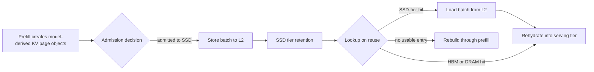

# Workload Correspondence Call Prep

## Purpose

Use this note to validate whether the benchmark workload represents the
customer's intended IPU, Xeon, and SSD data path. It is an internal call-prep
artifact, not a customer performance claim.

The August 2026 external brief establishes the current benchmark boundary:
FIO measures the storage and transport envelope, while `lmcache bench l2`
creates model-derived KV-page Store and Load batches. The open question is
whether their geometry, timing, tier transitions, and latency criteria match
the intended deployment.

## Desired Call Outcome

Agree on a small workload contract for two or three production workload
classes. For each class, capture:

- When KV data enters SSD and why.
- When it is loaded from SSD rather than HBM, DRAM, or recomputation.
- Object and batch geometry.
- Read/write timing, concurrency, and burst behavior.
- Retrieval tail-latency requirement under concurrent Store pressure.
- Admission, retention, eviction, and sharing rules.

## Workload Contract Diagram



The customer should mark this diagram rather than answer a generic question
about benchmark realism:

1. Which arrows cross SSD in production?
2. What event triggers each Store and Load?
3. Which arrows can overlap?
4. Which queues or pauses are on the critical path for TTFT or resume?
5. Where do sharing and tenant isolation apply?

## Parameters To Attach To The Diagram

| Transition | Parameters to validate |
|---|---|
| Prefill -> admission | model, context-length bucket, bytes per KV page, pages per request, admission reason |
| Store -> SSD | objects per Store submit, bytes per submit, Store concurrency, write burst duration |
| Retention -> lookup | TTL, eviction cause, resident-byte target, pinning, sharing scope |
| Lookup -> Load | tier-attributed hit rate, objects per Load submit, load concurrency, queue delay |
| Load -> serving tier | p99 and p99.9 completion budget, allowed impact on TTFT or resume SLO |

## Benchmark Correspondence

| Tool | Represents | Does not represent |
|---|---|---|
| FIO | Device, PCIe, NVMe-oF, filesystem, and fabric envelope for a chosen block size and queue shape | Model KV geometry, admission, eviction, object batching, or production arrival timing |
| `lmcache bench l2` | Model-derived KV page objects, L2 Store/Load batches, worker count, and explicit in-flight scheduling | Transformer execution, serving scheduler behavior, upper-tier admission, or real tenant arrivals |
| Mooncake storage benchmark | Trace replay, prefix hit/miss behavior, and workload-class sensitivity | The customer's workload unless trace semantics and parameters are mapped explicitly |
| Full inference stack | End-to-end serving behavior and actual TTFT/resume outcome | A clean storage or transport ceiling |

`lmcache bench l2` should be described as an object-level storage-adapter
workload. It does not simulate individual tensor compute execution or claim to
be a production inference scheduler.

## Priority Questions

### Tier Semantics

1. Of logical KV-cache hits, what fraction is served from HBM, host DRAM, and
   SSD? How are partial-prefix hits counted?
2. Is an SSD Store caused by prefill completion, HBM/DRAM eviction, request
   suspension, explicit checkpointing, or an admission policy?
3. On reuse, when is SSD retrieval selected instead of DRAM retrieval or
   recomputation from the prompt?
4. What invalidates KV state: TTL, capacity, model revision, deployment
   restart, tenant policy, routing change, or a cache-controller decision?

### Geometry And Timing

5. For the top three models, what are the distributions of bytes per KV page,
   pages per request, and bytes per Store/Load submit?
6. Is a full-layer Store/Load batch appropriate, or are pages loaded in a
   smaller subset or staged sequence?
7. What are p50, p95, and p99 read and write bytes/s, object rate, and
   concurrent requests for each workload class?
8. During a retrieve burst, how much concurrent Store traffic must the target
   sustain? Is the traffic a steady ratio, a prefill-write burst, or distinct
   alternating phases?

### Service Contract

9. What retrieval completion latency at p99 and p99.9 preserves the TTFT or
   resume SLO under concurrent Store pressure?
10. Is reuse confined to one conversation, shared across sessions for one
    tenant, or shared across tenants for common prefixes?
11. Which KV entries are pinned, prewarmed, or retained deliberately?
12. How do the four 400GbE ports map to initiators, namespaces, and SSD sets?
    Is balance guaranteed, or can a model or tenant create a hot target?

## Prompt Caching Is A Separate Question

Anthropic API prompt caching must not be treated as a direct measurement of
SSD-tier KV traffic. It caches a full request prefix through a cache breakpoint
and exposes API usage categories such as `cache_creation_input_tokens` and
`cache_read_input_tokens`. Its documented five-minute default TTL and
one-hour option describe API cache behavior, not the location or physical I/O
of a storage-tier KV cache.

Ask instead:

> Which API-level prompt-cache behaviors map to reusable KV state in the
> serving stack, and which remain entirely inside a provider-managed cache
> layer?

Do not infer the reason for overnight clearing from the API cache TTL. The
customer should identify whether clearing is driven by capacity, model or
deployment changes, privacy policy, cache invalidation, or low expected reuse.

## Mooncake As A Sensitivity Input

Mooncake's storage benchmark is useful for sensitivity analysis, not as a
Frontier proxy by default. Its documentation describes replay of FAST25 JSONL
traces, a single large-file storage model, and 512-token hash blocks; it offers
write-intensive `conversation`, read-intensive `synthetic`, and balanced
`toolagent` scenarios.

Ask:

> Can your production workload classes be mapped to one of these trace
> shapes, or should we derive anonymized aggregates from scheduler and
> cache-controller telemetry instead?

## Data Request

A privacy-safe 15-minute binned export for two or three workload classes is
enough. Raw prompts or customer content are not needed.

```text
model/version, request class, context-length bucket,
logical-hit outcome, serving tier, cache-object bytes,
objects per Store/Load, read bytes, write bytes,
concurrent retrieves, concurrent stores, queue delay,
TTFT/resume latency, eviction reason
```

## Recommended Close

> We are not asking you to validate our benchmark. We are asking for the
> minimum workload facts needed to make its object geometry, scheduling, tier
> transitions, and tail-latency acceptance criteria representative.
