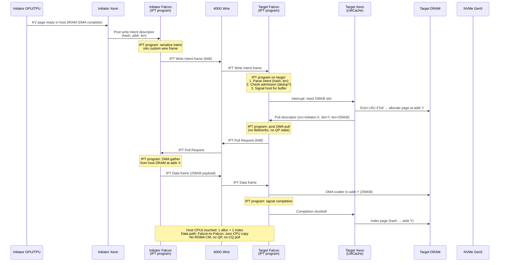
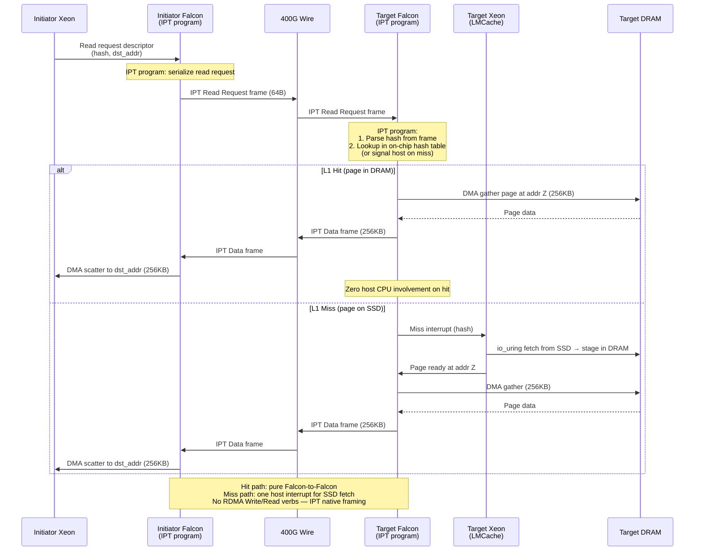

# IPU RDMA Platform Backend

Design doc for the IPU-accelerated KV cache transfer layer in LMCache.

## Problem Statement

LMCache's multiprocess transfer path currently supports two IPC mechanisms:

- **CUDA IPC** (`CudaIPCWrapper`) — zero-copy GPU tensor sharing via shared
  CUDA storage handles, intra-host only.
- **POSIX SHM** (`CpuShmTensorWrapper`) — zero-copy CPU tensor sharing via
  `shm_open`/`mmap`, intra-host only.

Neither supports inter-host transfer. For disaggregated KV cache serving at
400 Gb/s, we need a data-plane path where:

1. KV pages move between hosts without CPU touching data bytes.
2. The receiver (target) controls when and where data arrives (pull model).
3. Transfer granularity matches IPU DMA sweet spot (128-256 KB).

Intel IPU (Infrastructure Processing Unit) provides RDMA-capable network
offload — the same role Google's TPU nodes use their IPUs for. Every node in
the target deployment has an IPU as its network interface; there is no
separate NIC.


## Design Alternatives Considered

### Option A: Target-Only IPU (Asymmetric)

Only the target (Xeon storage server) has an IPU. The initiator (GPU host)
uses a standard NIC or software RDMA (RXE/SIW). The target's IPU posts RDMA
Read verbs to pull data from the initiator's host DRAM.

```
    INITIATOR (GPU host, standard NIC)          TARGET (Xeon + IPU)
    +---------------------------------+         +----------------------------------+
    |  GPU (compute)                  |         |                                  |
    |    | HBM->DRAM (PCIe DMA)       |         |                                  |
    |    v                            |         |                                  |
    |  Host DRAM (ibv_reg_mr)         |         |  Host DRAM (registered, L1 pool) |
    |    |                            |         |    ^                             |
    |    | data flow (RDMA Read resp) |         |    | data lands here             |
    |    v                            |         |    |                             |
    |  +-----+                        |         |  +-----+                         |
    |  | NIC |-------- data --------->|-------->|  | IPU |  posts RDMA Read         |
    |  +-----+                        |         |  +-----+                         |
    |                                 |         |                                  |
    |  CPU: ibv_reg_mr, announce      |         |  CPU: admission, eviction, hash  |
    +---------------------------------+         +----------------------------------+
```

**Pros:** Simpler initiator integration (standard libibverbs). Only target
needs IPU driver support.

**Cons:** CPU on the initiator is involved in MR registration and may need to
fence GPU-to-DRAM DMA. Initiator NIC may not match 400G line rate under
concurrent load. Does not match the deployment reality where all nodes have
IPUs.


### Option B: Symmetric IPU (Chosen)

Both initiator and target have an IPU as their network interface. All
data-plane movement is IPU-to-IPU. CPU on each side handles control plane
only (hash lookup, admission control, eviction decisions, ZMQ signaling).
CPU never touches KV data bytes.

The initiator is a compute node (TPU/GPU + IPU); the target is a Xeon
storage server (CPU + IPU + NVMe SSDs, no accelerator).

```
    INITIATOR (compute node)                    TARGET (Xeon storage server)
    +----------------------------------+        +----------------------------------+
    |  TPU/GPU (compute)               |        |                                  |
    |    | HBM->DRAM (DMA)             |        |  Xeon CPU (control plane only)   |
    |    v                             |        |    | hash, admission, eviction   |
    |  Host DRAM                       |        |    v                             |
    |  (IPU-registered MR)             |        |  Host DRAM (L1 cache pool)       |
    |    |                             |        |  (IPU-registered MR)             |
    |    | data (RDMA Read response)   |        |    ^                             |
    |    v                             |        |    | data lands here (DMA)       |
    |  +-----+                         |        |  +-----+                         |
    |  | IPU |------- 256KB data ------|------->|  | IPU |  posts RDMA Read         |
    |  +-----+                         |        |  +-----+                         |
    |                                  |        |                                  |
    |  CPU: register MR, announce      |        |  8x NVMe SSD (L2 cold tier)      |
    |       intent, fence DMA          |        |                                  |
    +----------------------------------+        +----------------------------------+
```

**Pros:** Matches real deployment topology (every node has an IPU as its
network interface — there is no separate NIC). Zero CPU data touch on both
sides. IPU handles RDMA Read response DMA from registered DRAM without CPU
intervention. Full 400G line rate achievable.

**Cons:** Requires IPU driver/SDK on both sides for MR registration. Slightly
more complex `wrap()` path (must coordinate with IPU memory registration).

**Why we chose Option B:** The target deployments (Intel IPU clusters, Google
TPU nodes) have an IPU on every node — there is no separate NIC. The
asymmetric model is a fiction that does not match hardware reality. The
symmetric design also gives us the zero-CPU-data-touch property on both sides,
which is critical for sustained 400 Gb/s. The target is specifically a Xeon
storage server (no GPU/TPU) — its role is to serve cached KV pages from
DRAM/SSD, not to run inference.


## Chosen Architecture

### Layer Map

```
    +-------------------------------------------------------------+
    | Layer 1: DeviceIPCWrapper (how memory is exposed)            |
    |   CudaIPCWrapper        -- CUDA IPC handle (intra-host)     |
    |   CpuShmTensorWrapper   -- POSIX shm_name + mmap            |
    |   IPURdmaWrapper (NEW)  -- rkey + remote_vaddr + length      |
    +-------------------------------------------------------------+
    | Layer 2: TransferContext (how store/retrieve are submitted)  |
    |   LMCacheDrivenTransferContext (REUSED, no changes)          |
    |     - passes event.ipc_handle() -> server calls to_tensor() |
    +-------------------------------------------------------------+
    | Layer 3: Platform registry (auto-discovery by device_type)   |
    |   "cuda" -> CudaIPCWrapper.wrap                             |
    |   "cpu"  -> CpuShmTensorWrapper.wrap                        |
    |   "ipu"  -> IPURdmaWrapper.wrap (NEW)                       |
    +-------------------------------------------------------------+
```

Key decisions:

1. We do NOT add a new `TransferContext` subclass. The existing
   `LMCacheDrivenTransferContext` already implements pull semantics (server
   receives handle, calls `to_tensor()` at its own pace). We only need a new
   `DeviceIPCWrapper` that makes `to_tensor()` post an RDMA Read instead of
   doing a local mmap.

2. **RDMA pulls write data** — the storage server (target) always initiates
   the data transfer via RDMA Read. This keeps the storage server in full
   control of its DRAM budget: it only pulls data after admission control
   passes and a destination page is allocated. The slight increase in latency
   (one extra RTT for the Read vs a push) is acceptable because it prevents
   unbounded memory pressure from concurrent writers at 400G line rate.

3. **LMCache with DeepSeek as proxy reference** — DeepSeek workload patterns
   (long context, high prefix reuse) drive the KV paging design. Fixed packet
   size per model based on size of KV page (256 tokens default). Network
   traffic patterns depend on model characteristics (layer count determines
   burst depth, dtype determines page bytes).


### Data Flow — Store Path (Write)

```
    Initiator CPU                     Wire            Target Xeon CPU
    --------------------              ----            -------------------
    1. Receive KV from               |              |
       compute (TPU/GPU              |              |
       DMA to host DRAM)             |              |
                                     |              |
    2. Fence: ensure DMA             |              |
       complete                      |              |
                                     |              |
    3. IPURdmaWrapper.wrap()         |              |
       - MR already registered       |              |
       - produce (rkey, vaddr, len)  |              |
                                     |              |
    4. submit_store() via ZMQ -------|--- msg ----->| 5. Server receives wrapper
       (control plane only,          |              |    (rkey, vaddr, len, key)
        sends wrapper + key)         |              |
                                     |              | 6. Admission check:
                                     |              |    room in L1?
                                     |              |    - yes: allocate page
                                     |              |    - no: evict LRU to SSD
                                     |              |          then allocate
                                     |              |
                                     |              | 7. wrapper.to_tensor():
                                     |              |    Target CPU posts RDMA Read
                                     |              |    (src: rkey+vaddr on initiator,
                                     |              |     dst: local allocated page,
                                     |              |     len: 256KB)
                                     |              |
    Initiator IPU serves     --------|-- 256KB ---->|    Target IPU receives data
    RDMA Read response               |              |    into local page (DMA)
    (no CPU involvement)             |              |
                                     |              | 8. Poll CQ -> completion
                                     |              |
                                     |              | 9. Index page by token hash
                                     |              |    -> done
```


### Data Flow — Retrieve Path (Read / Cache Hit)

```
    Initiator CPU                     Wire            Target Xeon CPU
    --------------------              ----            -------------------
    1. submit_retrieve()             |              |
       via ZMQ (key + handle) -------|--- msg ----->| 2. Hash lookup in L1
                                     |              |    - hit: have page in DRAM
                                     |              |    - miss: fetch from SSD
                                     |              |          (io_uring/SPDK)
                                     |              |
                                     |              | 3. Target CPU posts RDMA
                                     |              |    Write to initiator's
                                     |              |    registered DRAM
                                     |              |    (IPU executes DMA)
                                     |              |
    IPU receives data         <------|-- data ------|    (256KB per layer-chunk)
    (RDMA Write completion)          |              |
                                     |              |
    4. Completion -> KV in           |              | 5. Send completion ACK
       host DRAM -> DMA to           |              |    via ZMQ
       TPU/GPU HBM (KV cache)        |              |
```

Note: the retrieve path uses RDMA Write (target pushes to initiator). This
keeps the target in control of both directions — it decides when to send, and
the initiator's IPU simply accepts the incoming write into pre-registered DRAM.
The store path uses RDMA Read (target pulls from initiator) because the target
must control admission timing.


### Wire Transfer Unit

A single per-layer KV chunk on the wire (the atomic RDMA operation):

```
    page_bytes = kv_size x num_kv_heads x head_size x dtype_bytes x tokens_per_chunk
```

The KV page is a **fixed size of 256 tokens** per the project requirement.
Network traffic patterns depend on model characteristics (layer count, KV
heads, dtype). The packet size on the wire is fixed per model.

| Model           | Tokens/Chunk | Dtype | Page Size | Burst (all layers) |
|-----------------|--------------|-------|-----------|--------------------|
| DeepSeek-V3     | 256          | FP8   | 512 KB    | 61 x 512KB = 31 MB |
| Llama-3.1 70B   | 256          | FP8   | 512 KB    | 80 x 512KB = 40 MB |
| Llama-3.1 8B    | 256          | FP8   | 512 KB    | 32 x 512KB = 16 MB |
| Llama-3.1 405B  | 256          | FP8   | 512 KB    | 126 x 512KB = 63 MB|
| Mixtral 8x22B   | 256          | FP8   | 512 KB    | 56 x 512KB = 28 MB |

Note: DeepSeek-V3 uses MLA (Multi-head Latent Attention) with compressed KV,
so actual per-layer page size may differ — the 512KB figure assumes standard
GQA-8 for comparison. See model configs for exact sizing.

**IPU-optimized alternative (128 tokens/chunk):**

| Model           | Tokens/Chunk | Dtype | Page Size | Burst (all layers) |
|-----------------|--------------|-------|-----------|--------------------|
| DeepSeek-V3     | 128          | FP8   | 256 KB    | 61 x 256KB = 15 MB |
| Llama-3.1 70B   | 128          | FP8   | 256 KB    | 80 x 256KB = 20 MB |
| Llama-3.1 405B  | 128          | FP8   | 256 KB    | 126 x 256KB = 32 MB|

The 128-token variant yields 256KB pages which match IPU DMA optimal transfer
size (128-256KB). This may give better utilization of the 32KB IPU cache for
per-packet processing. Both 256 and 128 are valid configurations — the choice
is a latency vs throughput tradeoff that benchmarks (scenarios 1-4) will
inform.

**Proxy reference model:** LMCache with DeepSeek as the primary workload
characterization target. DeepSeek's long-context usage patterns (32K-128K
token sequences) and high prefix reuse rates make it an ideal proxy for
validating the cache hit/miss ratios and burst patterns.


### Chunk Size Validation

The LMCache stack propagates `chunk_size` cleanly. Verified constraints:

- `chunk_size % vllm_block_size == 0`: 256 % 16 = 0, 128 % 16 = 0 (both pass)
- `chunk_size % tokens_per_block == 0`: same check (both pass)
- Token offsets must be multiples of `chunk_size`: enforced by session manager
- BLAKE3 hash granularity: works on any chunk_size

No code changes needed — `chunk_size` is a server config parameter (default
256, matching the requirement). Set to 128 for IPU-optimized mode.


## Implementation

### File Layout

```
    lmcache/v1/platform/ipu/
    +-- __init__.py              Package marker (matches cpu/cuda pattern)
    +-- rdma_wrapper.py          IPURdmaWrapper (DeviceIPCWrapper subclass)
    +-- rdma_transport.py        RdmaTransport protocol + stub implementation
    +-- verbs_transport.py       VerbsRdmaTransport (libibverbs backend via pyverbs)
```

### IPURdmaWrapper

The wrapper carries an RDMA memory region descriptor. On the initiator side,
`wrap()` produces it; on the target side, `to_tensor()` consumes it:

```
    class IPURdmaWrapper(DeviceIPCWrapper):
        device_type = "ipu"
        _is_default_wrapper = True

        # Stored fields (serialized across wire via pickle)
        rkey: int               # Remote key for RDMA access
        remote_addr: int        # Virtual address in remote MR
        length: int             # Bytes (256KB for one layer-chunk)
        dtype: torch.dtype      # Element type of the tensor
        shape: tuple            # Original tensor shape
        stride: tuple           # Original tensor stride
        storage_offset: int     # Storage offset
        device_uuid: str        # Always "ipu"

        wrap(tensor) -> IPURdmaWrapper:
            - Verify tensor is contiguous, in registered DRAM
            - Look up (or register) MR with IPU transport layer
            - Return wrapper with rkey + vaddr + length + metadata

        to_tensor() -> torch.Tensor:
            - Allocate local registered buffer (from target's page pool)
            - Post RDMA Read via RdmaTransport
            - Poll for completion (with timeout → drain → quarantine)
            - Transfer buffer ownership to tensor via weakref finalizer
            - Return buffer as torch.Tensor view
```

### RdmaTransport Protocol

An abstraction over the actual RDMA verbs implementation, so the initial code
can be tested with a stub while the real IPU SDK binding is developed
separately:

```
    class RdmaTransport(Protocol):
        def register_mr(buffer_ptr, length) -> MrInfo
        def deregister_mr(mr: MrInfo) -> None
        def post_read(local_buf: RegisteredBuffer, remote_addr, rkey, length) -> RdmaFuture
        def post_write(local_buf: RegisteredBuffer, remote_addr, rkey, length) -> RdmaFuture
        def poll_completion(future: RdmaFuture, timeout_ms) -> bool
        def allocate_buffer(length) -> RegisteredBuffer
        def free_buffer(buf: RegisteredBuffer) -> None
        def release_buffer_tracking(buf: RegisteredBuffer) -> None
        def drain_on_timeout() -> bool
```

The stub implementation uses `memcpy` over shared memory for local testing.
The real implementation wraps libibverbs (or the IPU SDK equivalent) — see
[verbs-transport.md](verbs-transport.md) for the full implementation spec
(QP state machine, lock protocol, buffer quarantine, MR lifecycle).


### Integration with Existing Code

No changes to:
- `LMCacheDrivenTransferContext` (reused as-is)
- `create_transfer_context()` factory (already dispatches by device_type)
- Platform auto-discovery (`_discover_wrappers_once` finds the new subclass)
- Token hasher, session manager, cache engine

The only new config surface:
- `LMCACHE_MP_TRANSFER_MODE=lmcache_driven` (already the right mode)
- `chunk_size=128` (existing config key)
- RDMA transport backend selection (new env var: `LMCACHE_RDMA_TRANSPORT`)


### DMA Fence Requirement

On the initiator, compute engine (TPU/GPU) writes KV to host DRAM via DMA.
The `wrap()` method must not return until that DMA is complete — otherwise the
IPU may serve stale data on RDMA Read. The fence contract:

```
    # In the vLLM adapter, before wrap():
    torch_dev.synchronize()  # fence: GPU/TPU DMA complete
    wrapper = IPURdmaWrapper.wrap(tensor)  # safe to serve
```

This fence already exists in the `EngineDrivenTransferContext` path
(`torch_dev.synchronize()` at line 413 of `worker_transfer.py`). For the
`LMCacheDrivenTransferContext` path, the fence is implicit in the CUDA IPC
handle — but for IPU we need to ensure the adapter inserts it. This is
handled by the `IPCEvent` protocol: the event's `ipc_handle()` method should
not return until the source buffer is stable.


### Testing Strategy

1. **Unit tests with stub transport**: `RdmaTransport` stub uses local
   `memcpy`. Tests verify the full `wrap()` -> serialize -> `to_tensor()`
   round-trip including buffer allocation and tensor shape reconstruction.

2. **Integration test with loopback**: Two processes on one host, stub
   transport, verify store/retrieve through the real LMCache server stack.

3. **Hardware validation**: Real RDMA transport on IPU hardware, using the
   benchmark scenarios defined in
   `docs/design/tools/ipu_traffic_benchmarks/`.


## Running Tests

### Unit Test (stub transport, no hardware required)

```bash
# From the repo root. Uses StubRdmaTransport (memcpy, same process).
pytest tests/v1/platform/test_ipu_rdma_wrapper.py -v
```

The unit test exercises:
- `IPURdmaWrapper.wrap()` on a random CPU tensor
- Pickle round-trip (simulates ZMQ wire serialization)
- `to_tensor()` on the deserialized wrapper (RDMA Read via stub memcpy)
- Tensor content and shape equality between source and result


### Integration Test (stub transport, two processes)

```bash
# Terminal 1: start LMCache server with chunk_size=256 (default, per requirement)
lmcache server \
    --port 5555 \
    --http-port 8080 \
    --l1-size-gb 1 \
    --chunk-size 256 \
    --eviction-policy LRU

# Terminal 2: run the server_bench tool in IPU stub mode
LMCACHE_RDMA_TRANSPORT=stub \
LMCACHE_MP_TRANSFER_MODE=lmcache_driven \
lmcache bench server \
    --rpc-url tcp://127.0.0.1:5555 \
    --url http://127.0.0.1:8080 \
    --mode ipu \
    --num-tokens 256 \
    --end 3
```

Expected output: store/retrieve latencies with checksum verification pass.
The stub transport uses memcpy so latencies reflect control-plane overhead
only (ZMQ + hash + allocation), not wire transfer.


### Hardware Benchmark (real RDMA, requires IPU nodes)

Requires two nodes with IPU connectivity. Uses the traffic benchmark configs
from `docs/design/tools/ipu_traffic_benchmarks/`.

```bash
# On the TARGET node (Xeon storage server):
LMCACHE_RDMA_TRANSPORT=verbs \
lmcache server \
    --port 5555 \
    --http-port 8080 \
    --l1-size-gb 64 \
    --chunk-size 256 \
    --eviction-policy LRU

# On the INITIATOR node (compute host):
# Default 256 tokens/chunk -> 512KB pages (per requirement)
LMCACHE_RDMA_TRANSPORT=verbs \
LMCACHE_MP_TRANSFER_MODE=lmcache_driven \
lmcache bench server \
    --rpc-url tcp://<target-ip>:5555 \
    --url http://<target-ip>:8080 \
    --mode ipu \
    --transfer-mode lmcache_driven \
    --num-tokens 256 \
    --object-size 524288 \
    --num-objects 80 \
    --end 100

# IPU-optimized alternative: 128 tokens/chunk -> 256KB pages
# Add --chunk-size 128 --object-size 262144 to both server and bench
```

This exercises Scenario 1 (L1 DRAM hit, RDMA serve) from the benchmark
matrix. For the full scenario set:

```bash
# Run all 9 benchmark scenarios with the 70B FP8 model config:
lmcache bench ipu \
    --config docs/design/tools/ipu_traffic_benchmarks/scenarios/ \
    --model docs/design/tools/ipu_traffic_benchmarks/models/llama3_70b_fp8.yaml \
    --target tcp://<target-ip>:5555
```

See `docs/design/tools/ipu_traffic_benchmarks/README.md` for the full
scenario matrix, expected metrics, and monitoring setup.


### Environment Variables Reference

| Variable                    | Values              | Default | Purpose                          |
|-----------------------------|---------------------|---------|----------------------------------|
| `LMCACHE_RDMA_TRANSPORT`   | `stub`, `verbs`     | `stub`  | RDMA backend selection           |
| `LMCACHE_RDMA_ROLE`        | `initiator`, `target` | — (required) | Process role (fail fast if unset) |
| `LMCACHE_RDMA_DEVICE`      | IB device name      | first active | Device selection             |
| `LMCACHE_RDMA_PORT`        | integer             | `1`     | IB port number                   |
| `LMCACHE_RDMA_GID_INDEX`   | integer             | `0`     | GID table index (RoCE)           |
| `LMCACHE_MP_TRANSFER_MODE` | `auto`, `lmcache_driven`, `engine_driven` | `auto` | Transfer context routing |
| `chunk_size` (server config)| integer             | 256     | Tokens per hash chunk (use 128)  |

For the full env var reference (PSN, nonce, remote params, rendezvous files),
see [verbs-transport.md](verbs-transport.md#environment-variables).


## Future Enhancement: Direct-to-Accelerator Retrieve

The current design uses a two-hop retrieve path:

```
    Target DRAM --RDMA--> Initiator Host DRAM --DMA--> TPU/GPU HBM (KV cache)
```

The `to_tensor()` call lands data in host DRAM. The inference engine then
copies it into the active KV cache blocks in accelerator HBM. This matches
the existing `DeviceIPCWrapper.to_tensor()` contract and works universally.

A future optimization would bypass host DRAM entirely on the retrieve path:

```
    Target DRAM --RDMA Write--> TPU/GPU HBM (KV cache blocks) directly
```

This requires:
- **For GPUs:** GPUDirect RDMA — NIC/IPU DMAs directly into GPU HBM via PCIe
  BAR. NVIDIA supports this with `ibv_reg_mr` over GPU memory.
- **For TPUs:** TPU HBM must be PCIe-BAR-exposed to the IPU. Not publicly
  documented whether Google exposes this.

The direct path would bypass `to_tensor()` entirely — data goes straight to
the vLLM block_id destination in HBM without materializing a host-memory
tensor. This would require a new interface (likely below TransferContext)
that maps RDMA target addresses directly to KV cache block slots.

**Status:** Deferred. Current implementation targets the two-hop path. The
direct-to-accelerator path is a performance optimization for after hardware
validation confirms PCIe BAR accessibility from the IPU on both GPU and TPU
platforms.


## Future Enhancement: Anjali's IPT Transport (Custom Transport)

An alternative to mapping KV cache semantics onto standard RDMA verbs or
NVMe-oF framing: run a purpose-built transport program directly on the Falcon
microcontroller cores inside the MMG-400 IPU.

Intel Programmable Transport (IPT) allows custom protocol logic to execute on
the IPU's Falcon cores at wire speed. For KV cache movement, this means the
pull model semantics (write intent → admission → RDMA Read → index) can be
expressed as a native transport program rather than layered atop generic verbs.

```
    Current stack (layered):              IPT stack (native):
    ┌──────────────────────────┐          ┌──────────────────────────┐
    │  LMCache control plane   │          │  LMCache control plane   │
    ├──────────────────────────┤          ├──────────────────────────┤
    │  ZMQ signaling           │          │                          │
    ├──────────────────────────┤          │  IPT program on Falcon   │
    │  libibverbs / NVMe-oF    │          │  (intent queue, pull,    │
    ├──────────────────────────┤          │   DMA scatter-gather,    │
    │  RDMA CM / TCP           │          │   completion signaling)  │
    ├──────────────────────────┤          │                          │
    │  IPU hardware (DMA, TSO) │          ├──────────────────────────┤
    └──────────────────────────┘          │  IPU hardware (DMA, TSO) │
                                          └──────────────────────────┘
```

**Potential advantages:**

- Eliminates protocol overhead from generic RDMA/NVMe framing (command
  capsules, completion queues, connection management).
- Intent queuing and admission backpressure live on the IPU — host CPU sees
  only completions, not per-page control messages.
- KV page headers (hash, length, layer_id) can be parsed and routed entirely
  in Falcon, enabling hardware-level deduplication checks.
- Collapses the "which transport?" question — benchmark scenarios 1-6 become
  a single IPT-native path.

**Data flow — IPT write path (store):**



**Data flow — IPT read path (retrieve / cache hit):**



**Relationship to current design:**

The `RdmaTransport` protocol abstraction already isolates the transport layer.
An IPT backend would implement the same interface (`register_mr`, `post_read`,
`post_write`, `poll_completion`) but backed by IPT program calls rather than
libibverbs. The `IPURdmaWrapper` and `LMCacheDrivenTransferContext` layers
remain unchanged.

**Status:** Under patent by Anjali's team. Integration depends on IPT SDK
availability and Falcon program toolchain access. Current implementation
proceeds with standard RDMA verbs; IPT is a drop-in replacement at the
`RdmaTransport` layer when ready.


## Open Questions

1. **Retrieve path direction** (resolved): target pushes via RDMA Write
   (`post_write`, LMCache-zbg) rather than initiator pulling via RDMA Read.
   Push keeps the target in control of both directions, matching the store
   path's "target controls admission timing" invariant.

2. **MR lifetime management**: Should we pre-register the entire KV pool as
   one large MR at startup, or register per-chunk on demand? Per-chunk adds
   latency; pre-registration requires knowing pool size at init.
   Recommendation: pre-register the pool.

3. **Multi-QP striping**: For a full 70B burst (80 x 256KB = 20MB), should
   we stripe across multiple QPs for higher throughput, or pipeline on a
   single QP with sufficient queue depth? The benchmark scenarios (7, 8, 9)
   will inform this.

4. **Completion model**: Busy-poll CQ vs event-driven (epoll on comp
   channel)? At 400G, busy-poll is likely required for latency. The
   `RdmaTransport.poll_completion()` method supports both.

5. **Direct-to-accelerator**: Is TPU HBM PCIe-BAR-exposed to the IPU? If
   yes, the retrieve path can skip host DRAM entirely (see Future Enhancement
   section above).
